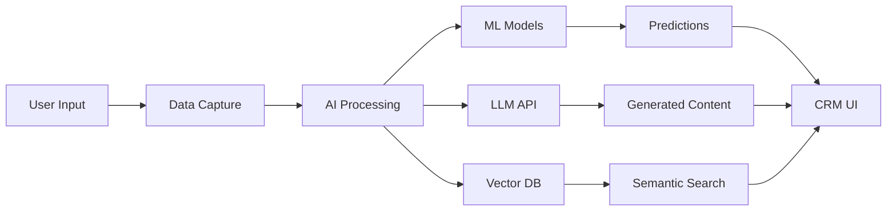

# AI Overview

HotCRM is an **AI-first enterprise CRM** that embeds artificial intelligence capabilities throughout the entire customer lifecycle. Built on modern AI technologies including NLP, ML, LLMs, and vector embeddings, HotCRM provides intelligent automation and insights to help teams work smarter.

## AI Vision

HotCRM's AI capabilities are designed to:
- **Reduce manual work** through intelligent automation
- **Improve decision-making** with predictive analytics
- **Enhance customer insights** using data analysis
- **Accelerate sales cycles** with smart recommendations
- **Improve service quality** through intelligent routing and knowledge management

## AI Technology Stack

### 1. Natural Language Processing (NLP)

NLP enables HotCRM to understand and process human language in emails, meeting notes, case descriptions, and more.

**Capabilities:**
- Text analysis and extraction
- Sentiment analysis (Positive, Neutral, Negative, Angry)
- Entity recognition (names, companies, products)
- Language detection
- Email signature parsing

**Use Cases:**
- Extract contact information from email signatures
- Analyze customer sentiment in support cases
- Identify key entities in meeting transcriptions
- Categorize case types automatically

### 2. Machine Learning (ML)

ML models learn from historical data to make predictions and recommendations.

**Capabilities:**
- Predictive scoring algorithms
- Classification models
- Recommendation engines
- Pattern recognition
- Anomaly detection

**Use Cases:**
- Lead scoring (0-100 quality score)
- Opportunity win probability prediction
- Customer churn risk analysis
- Smart lead assignment
- Product recommendation

### 3. Large Language Models (LLM)

LLMs provide generative AI capabilities for content creation and intelligent assistance.

**Capabilities:**
- Text generation and summarization
- Content creation (emails, proposals)
- Question answering
- Conversation understanding
- Multi-language support

**Use Cases:**
- Generate marketing email copy
- Summarize customer interactions
- Create sales proposal outlines
- Answer questions from knowledge base
- Generate product talking points

### 4. Vector Embeddings & RAG

Vector embeddings enable semantic search and retrieval-augmented generation (RAG) for knowledge management.

**Capabilities:**
- Semantic similarity search
- Context-aware retrieval
- Document embeddings
- Knowledge graph construction
- RAG-based Q&A

**Use Cases:**
- Semantic knowledge article search
- Find similar cases
- Recommend related content
- AI chatbot with company knowledge
- Intelligent document discovery

## AI Enhancement by Object

HotCRM embeds AI capabilities directly into business objects across the platform:

### Marketing & Leads

| Object | AI Features | Primary Use Case |
|--------|-------------|------------------|
| **Lead** | Lead scoring, data enrichment, signature parsing | Auto-calculate lead quality (0-100) |
| **Campaign** | Content generation, audience analysis, channel recommendations | Generate marketing email copy |

### Sales Automation

| Object | AI Features | Primary Use Case |
|--------|-------------|------------------|
| **Account** | News monitoring, risk alerts, interaction summaries | Identify customer risks from news |
| **Contact** | Relationship graph, decision maker identification | Find who really makes decisions |
| **Opportunity** | Win prediction, next steps, competitive intelligence | Suggest best follow-up tactics |
| **Activity** | Voice-to-text, action extraction, sentiment analysis | Auto-transcribe meeting recordings |
| **Product** | Sales points generation, bundling, pricing strategy | Generate product talking points |
| **Quote** | Bundle recommendations, optimal discount suggestions | Recommend product combinations |

### Customer Service

| Object | AI Features | Primary Use Case |
|--------|-------------|------------------|
| **Case** | Auto-categorization, smart routing, solution suggestions | Route to best available agent |
| **Knowledge** | Summarization, semantic search, RAG embeddings | AI chatbot answers questions |

## AI-Enhanced Fields

HotCRM uses a consistent naming convention for AI-generated fields:

```typescript
// Lead object example
{
  name: 'LeadScore',
  type: 'number',
  label: '线索评分',
  min: 0,
  max: 100,
  readonly: true,
  description: 'AI 自动计算的线索质量分数 (0-100)'
}

{
  name: 'AISummary',
  type: 'textarea',
  label: 'AI 线索分析',
  readonly: true,
  description: 'AI 生成的线索质量分析和建议'
}

{
  name: 'AIRecommendedAction',
  type: 'text',
  label: 'AI 推荐行动',
  readonly: true
}
```

**Common AI Field Patterns:**
- `AI[Feature]` - AI-generated content (e.g., `AISummary`, `AINextStepSuggestion`)
- `[Metric]Score` - AI-calculated scores (e.g., `LeadScore`, `QualityScore`)
- `AI[Type]Probability` - AI predictions (e.g., `AIWinProbability`)
- `AI[Subject]` - AI analysis fields (e.g., `AIRiskFactors`, `AICompetitiveIntel`)

## AI Data Flow



1. **Data Capture**: User input and system events
2. **AI Processing**: Route to appropriate AI service
3. **Model Execution**: ML models, LLMs, or vector search
4. **Results**: Predictions, content, or recommendations
5. **UI Display**: Present AI insights to users

## AI Model Training

HotCRM uses historical data to continuously improve AI models:

### Lead Scoring Model
- **Training Data**: Past leads with conversion outcomes
- **Features**: Industry, company size, engagement, completeness
- **Update Frequency**: Weekly retraining

### Win Probability Model
- **Training Data**: Historical opportunities with win/loss results
- **Features**: Deal size, stage, days open, activity count, competitor presence
- **Update Frequency**: Monthly retraining

### Smart Routing Model
- **Training Data**: Case assignments and resolution times
- **Features**: Case type, priority, agent skills, current workload
- **Update Frequency**: Real-time learning

## Privacy & Security

AI features in HotCRM respect data privacy and security:

- ✅ **Data encryption** at rest and in transit
- ✅ **Field-level security** controls AI data access
- ✅ **Opt-out options** for sensitive data
- ✅ **Audit logging** for all AI operations
- ✅ **GDPR compliance** for EU customers
- ✅ **Data residency** options for regulated industries

## Performance Metrics

Track AI effectiveness with built-in metrics:

- **Lead Score Accuracy**: Conversion rate by score range
- **Win Prediction Accuracy**: Actual vs. predicted outcomes
- **Agent Routing Efficiency**: Average resolution time by routing type
- **Knowledge Retrieval Quality**: User ratings on AI answers
- **Content Generation Usage**: Adoption rate of AI-generated content

## AI Configuration

Administrators can configure AI features:

```typescript
// AI Settings (config/ai.ts)
export const aiConfig = {
  leadScoring: {
    enabled: true,
    model: 'lead-score-v2',
    threshold: 70, // High-score threshold
    autoAssign: true // Auto-assign high-score leads
  },
  
  winProbability: {
    enabled: true,
    model: 'win-predict-v1',
    updateFrequency: 'daily'
  },
  
  knowledgeRAG: {
    enabled: true,
    vectorDB: 'pinecone',
    embeddingModel: 'text-embedding-ada-002',
    topK: 5 // Number of relevant articles to retrieve
  },
  
  voiceTranscription: {
    enabled: true,
    provider: 'whisper',
    languages: ['en', 'zh']
  }
};
```

## Next Steps

- [AI Capabilities](/docs/ai/capabilities) - Detailed AI feature documentation
- [Creating Objects](/docs/development/creating-objects) - Add AI fields to custom objects
- [ObjectQL API](/docs/api-reference/objectql-api) - Query AI-enhanced data

## Resources

- [OpenAI Platform](https://platform.openai.com/)
- [Vector Database Guide](https://www.pinecone.io/learn/vector-database/)
- [RAG Architecture](https://python.langchain.com/docs/use_cases/question_answering/)
