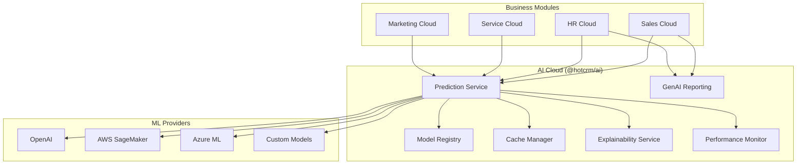

# AI Cloud Subsystem

The **AI Cloud** module (`@hotcrm/ai`) provides a unified AI/ML infrastructure for all HotCRM business modules. It follows a provider-based architecture supporting multiple ML frameworks and cloud services through a consistent interface.

## 1. Architecture Overview

The AI Cloud is designed as a **shared service layer** — it does not define its own business objects but provides ML capabilities consumed by other packages (Sales, HR, Service, Marketing). The architecture follows these principles:

- **Provider Abstraction**: Swap between OpenAI, AWS SageMaker, Azure ML, or custom models without changing consumer code.
- **Multi-Model Support**: Register and manage multiple models with versioning, A/B testing, and lifecycle tracking.
- **Built-in Observability**: Every prediction is cached, monitored, and explainable by default.
- **Graceful Degradation**: Falls back to in-memory cache and mock predictions when external services are unavailable.

## 2. Core Components

| Component | Module | Description |
|-----------|--------|-------------|
| **Model Registry** | `model-registry.ts` | Central catalog for all AI/ML models with versioning, configuration, and lifecycle management. |
| **Prediction Service** | `prediction-service.ts` | Unified inference interface with caching, A/B testing, batch support, and error handling. |
| **Cache Manager** | `cache-manager.ts` | Redis-based prediction caching with in-memory fallback. Configurable TTL per model. |
| **Explainability Service** | `explainability-service.ts` | SHAP-like feature attribution for model predictions. Generates human-readable explanations. |
| **Performance Monitor** | `performance-monitor.ts` | Real-time tracking of prediction latency, accuracy, cache hit rates, and health status. |
| **GenAI Reporting** | `genai_reporting.action.ts` | Natural language query interface for analytics. Converts questions to ObjectQL queries. |
| **AI Utilities** | `utils.ts` | Shared math and ML utilities: normalization, similarity, clustering, trend detection. |

## 3. Provider Integrations

All providers implement the `BaseMLProvider` abstract class defined in `providers/base-provider.ts`:

| Provider | Module | Capabilities |
|----------|--------|-------------|
| **OpenAI** | `openai-provider.ts` | NLP, classification, text generation, embeddings |
| **AWS SageMaker** | `aws-sagemaker-provider.ts` | Custom model hosting, batch inference, real-time endpoints |
| **Azure ML** | `azure-ml-provider.ts` | Managed model deployment, AutoML, batch scoring |

### 3.1 Provider Interface

Every provider must implement:

```typescript
abstract validate(): Promise<boolean>;
abstract predict<T>(modelId: string, input: PredictionInput): Promise<PredictionOutput<T>>;
abstract batchPredict<T>(modelId: string, inputs: PredictionInput[]): Promise<PredictionOutput<T>[]>;
abstract healthCheck(): Promise<{ healthy: boolean; latency?: number; error?: string }>;
```

### 3.2 Provider Configuration

```typescript
interface MLProviderConfig {
  provider: 'aws-sagemaker' | 'azure-ml' | 'openai' | 'anthropic' | 'custom';
  endpoint?: string;
  credentials: {
    apiKey?: string;
    secretKey?: string;
    region?: string;
  };
  config?: Record<string, any>;
}
```

## 4. Pre-Registered Models

The following models are registered by default in the Model Registry:

| Model ID | Name | Type | Metrics |
|----------|------|------|---------|
| `lead-scoring-v1` | Lead Scoring Model | Classification | Accuracy: 87.5%, F1: 87.1% |
| `churn-prediction-v1` | Churn Prediction Model | Classification | Accuracy: 82.3%, F1: 82.3% |
| `sentiment-analysis-v1` | Sentiment Analysis | NLP | Accuracy: 88.7%, F1: 88.6% |
| `revenue-forecast-v1` | Revenue Forecasting | Forecasting | MSE: 12,500, MAE: 8,200 |
| `product-recommendation-v1` | Product Recommendation | Recommendation | Precision: 75.8%, Recall: 78.3% |

## 5. Integration Diagram



## 6. Shared Utilities

The `utils.ts` module exports mathematical and ML helper functions used across all predictions:

- **Scoring**: `calculateConfidence`, `normalizeScore`, `weightedAverage`, `sigmoid`
- **Similarity**: `cosineSimilarity`
- **Statistics**: `standardDeviation`, `detectOutliers`, `pearsonCorrelation`
- **Time Series**: `movingAverage`, `exponentialSmoothing`, `calculateTrend`
- **Preprocessing**: `minMaxScale`, `zScoreNormalize`
- **Clustering**: `kMeansClustering`
