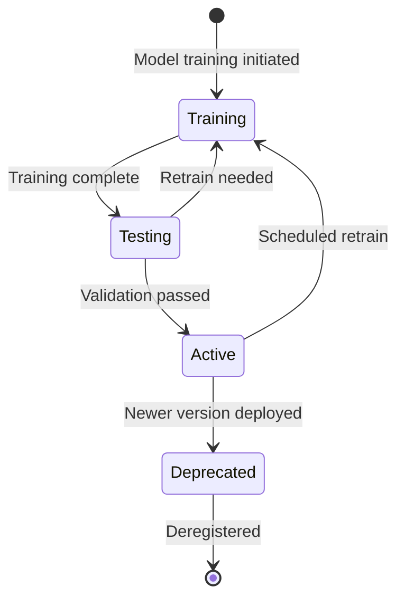

# Model Registry

The Model Registry (`model-registry.ts`) is the central catalog for all AI/ML models used across HotCRM. It provides model registration, versioning, lifecycle management, and configuration storage.

## 1. Model Lifecycle Management

### 1.1 Model States

Every model in the registry has a status that governs whether it can serve predictions:



| Status | Description | Can Serve Predictions? |
|--------|-------------|----------------------|
| `training` | Model is being trained or fine-tuned | No |
| `testing` | Model is in validation/testing phase | No |
| `active` | Production-ready, serving predictions | Yes |
| `deprecated` | Replaced by newer version, pending removal | No |

### 1.2 Registry API

```typescript
// Register a new model
ModelRegistry.register(config: ModelConfig): void;

// Retrieve model configuration
ModelRegistry.getModel(modelId: string): ModelConfig | undefined;

// List models with optional filters
ModelRegistry.listModels(filter?: { type?: ModelType; status?: string }): ModelConfig[];

// Update model status
ModelRegistry.updateStatus(modelId: string, status: ModelConfig['status']): void;

// Remove model from registry
ModelRegistry.unregister(modelId: string): void;

// Clear all models (testing only)
ModelRegistry.clear(): void;
```

## 2. Model Configuration

### 2.1 ModelConfig Interface

Each registered model is described by a `ModelConfig` object:

| Field | Type | Description |
|-------|------|-------------|
| `id` | `string` | Unique model identifier (e.g., `lead-scoring-v1`) |
| `name` | `string` | Human-readable model name |
| `version` | `string` | Semantic version (e.g., `1.0.0`) |
| `type` | `ModelType` | Model category (see below) |
| `provider` | `ModelProvider` | Framework or service hosting the model |
| `description` | `string` | Model purpose and capabilities |
| `endpoint` | `string?` | Remote inference endpoint URL |
| `credentials` | `object?` | API keys and authentication details |
| `providerConfig` | `MLProviderConfig?` | Full provider configuration |
| `parameters` | `Record<string, any>?` | Model hyperparameters |
| `metrics` | `object?` | Performance metrics (accuracy, precision, recall, F1, MSE, MAE) |
| `lastTrained` | `string?` | ISO date of last training run |
| `status` | `string` | Current lifecycle status |
| `abTest` | `object?` | A/B testing configuration |

### 2.2 Model Types

| Type | Use Cases |
|------|-----------|
| `classification` | Lead scoring, churn prediction, candidate fit |
| `regression` | Revenue prediction, salary benchmarking |
| `clustering` | Customer segmentation, account grouping |
| `nlp` | Sentiment analysis, text extraction, intent detection |
| `recommendation` | Product cross-sell, content recommendation |
| `forecasting` | Revenue forecast, pipeline projection, demand planning |

### 2.3 Model Providers

| Provider | Description |
|----------|-------------|
| `openai` | OpenAI API (GPT, embeddings) |
| `anthropic` | Anthropic API |
| `aws-sagemaker` | AWS SageMaker hosted models |
| `azure-ml` | Azure Machine Learning endpoints |
| `custom` | Self-hosted or rule-based models |
| `scikit-learn` | Scikit-learn models (local) |
| `tensorflow` | TensorFlow/Keras models |
| `pytorch` | PyTorch models |

## 3. Provider Configuration

Models can be linked to a specific ML provider through `providerConfig`:

```typescript
ModelRegistry.register({
  id: 'lead-scoring-v2',
  name: 'Lead Scoring Model v2',
  version: '2.0.0',
  type: 'classification',
  provider: 'aws-sagemaker',
  description: 'Enhanced lead scoring with SageMaker',
  status: 'active',
  providerConfig: {
    provider: 'aws-sagemaker',
    endpoint: 'https://runtime.sagemaker.us-east-1.amazonaws.com',
    credentials: {
      accessKeyId: process.env.AWS_ACCESS_KEY_ID,
      secretAccessKey: process.env.AWS_SECRET_ACCESS_KEY,
      region: 'us-east-1'
    }
  }
});
```

When a provider is configured, the Prediction Service uses `ProviderFactory.getProvider()` to instantiate the appropriate provider implementation. If the provider call fails, the service falls back to mock predictions for development resilience.

## 4. Version Tracking

Models follow semantic versioning (`major.minor.patch`). The recommended practice:

- **Patch** (`1.0.1`): Retrained with updated data, same architecture.
- **Minor** (`1.1.0`): New features added, backward-compatible.
- **Major** (`2.0.0`): Architecture change, new input/output schema.

Multiple versions can coexist in the registry. The Prediction Service resolves models by `id`, so version promotion is done by updating the `status` field:

1. Register new version as `testing`.
2. Validate against test dataset.
3. Set new version to `active`.
4. Set old version to `deprecated`.
5. Deregister old version after grace period.

## 5. A/B Testing

The registry supports champion-challenger A/B testing:

```typescript
ModelRegistry.register({
  id: 'lead-scoring-v2',
  // ...
  abTest: {
    enabled: true,
    trafficPercentage: 20,       // 20% traffic to challenger
    championModelId: 'lead-scoring-v1'  // 80% traffic to champion
  }
});
```

The `PredictionService.selectModelForABTest()` method randomly routes requests based on `trafficPercentage`. Both champion and challenger predictions are tracked by the Performance Monitor for comparison.

## 6. Performance Metrics

Each model can store its latest evaluation metrics:

```typescript
metrics: {
  accuracy: 87.5,    // Overall accuracy (%)
  precision: 85.2,   // Precision (%)
  recall: 89.1,      // Recall (%)
  f1Score: 87.1,     // F1 score (%)
  mse: 12500,        // Mean squared error (regression/forecasting)
  mae: 8200          // Mean absolute error (regression/forecasting)
}
```

These metrics are informational and stored alongside the model configuration. Runtime performance (latency, error rate, cache hits) is tracked separately by the Performance Monitor.
