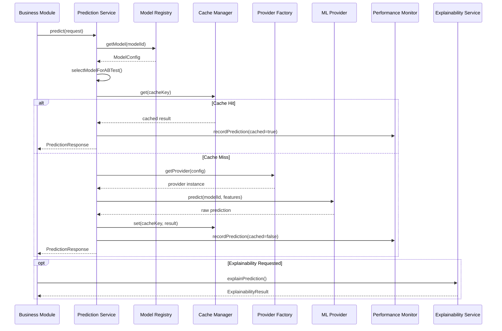

# Prediction Service

The Prediction Service (`prediction-service.ts`) provides a unified interface for making predictions across all registered AI models. It handles model resolution, provider invocation, caching, monitoring, and error handling.

## 1. Prediction Pipeline

### 1.1 Request Flow



### 1.2 Request Interface

```typescript
interface PredictionRequest {
  modelId: string;                    // Model to invoke
  features: Record<string, any>;      // Input feature map
  context?: {                         // Optional metadata
    userId?: string;
    objectType?: string;
    objectId?: string;
  };
  useCache?: boolean;                 // Default: true
  forceProvider?: BaseMLProvider;      // Override default provider
}
```

### 1.3 Response Interface

```typescript
interface PredictionResponse<T = any> {
  prediction: T;           // Model output
  confidence: number;      // Confidence score (0–100)
  modelId: string;         // Model used (may differ due to A/B test)
  modelVersion: string;    // Model version
  processingTime: number;  // Latency in milliseconds
  cached: boolean;         // Whether result was from cache
  metadata?: Record<string, any>;
}
```

### 1.4 Pipeline Steps

1. **Model Resolution**: Fetch model config from registry, verify `status === 'active'`.
2. **A/B Test Selection**: If A/B testing is enabled, randomly select champion or challenger model based on traffic percentage.
3. **Cache Check**: Generate deterministic cache key from `modelId` + serialized `features`. Return cached result if available.
4. **Provider Invocation**: Route to configured ML provider via `ProviderFactory`, or fall back to mock predictions.
5. **Response Assembly**: Package prediction with confidence, timing, and metadata.
6. **Cache Store**: Cache response with configurable TTL (default: 5 minutes).
7. **Metrics Recording**: Record prediction to Performance Monitor (latency, confidence, success/failure, cache status).

### 1.5 Batch Predictions

```typescript
PredictionService.batchPredict<T>(
  modelId: string,
  features: Array<Record<string, any>>,
  useCache?: boolean
): Promise<Array<PredictionResponse<T>>>
```

Batch predictions first attempt the provider's native `batchPredict()` method. If unavailable or failing, falls back to parallel individual predictions via `Promise.all`.

## 2. Caching Strategy

### 2.1 Architecture

The Cache Manager (`cache-manager.ts`) implements a dual-layer caching strategy:

| Layer | Backend | Use Case |
|-------|---------|----------|
| **Primary** | Redis | Production environments with Redis configured |
| **Fallback** | In-Memory `Map` | Development, testing, or when Redis is unavailable |

### 2.2 Configuration

```typescript
interface CacheConfig {
  redisUrl?: string;           // Redis connection URL
  defaultTtl?: number;         // Default TTL in seconds (default: 300)
  enabled?: boolean;           // Enable/disable caching (default: true)
  useMemoryFallback?: boolean; // Fall back to memory if Redis fails (default: true)
}
```

### 2.3 Cache Key Generation

Cache keys are deterministic, combining model ID and input features:

```
pred:{modelId}:{JSON.stringify(features)}
```

This ensures identical inputs to the same model always produce a cache hit within the TTL window.

### 2.4 TTL Management

- Default TTL: 300 seconds (5 minutes).
- Per-prediction TTL can be specified when calling `set()`.
- Expired entries are cleaned up probabilistically (10% chance on each `set()` call) to avoid performance overhead.

### 2.5 Cache Statistics

```typescript
cacheManager.getStats(): {
  size: number;       // Number of cached entries
  hits: number;       // Total cache hits
  backend: 'redis' | 'memory';
}
```

## 3. Explainability Features

### 3.1 Explainability Service

The Explainability Service (`explainability-service.ts`) provides SHAP-like feature attribution for any prediction:

```typescript
ExplainabilityService.explainPrediction(
  modelId: string,
  features: Record<string, any>,
  prediction: any,
  confidence: number
): Promise<ExplainabilityResult>
```

### 3.2 Feature Contributions

Each input feature receives a contribution score:

| Field | Type | Description |
|-------|------|-------------|
| `feature` | `string` | Feature name |
| `value` | `any` | Input value |
| `contribution` | `number` | Impact on prediction (–1 to +1) |
| `importance` | `number` | Absolute importance (0–100%) |

### 3.3 Explanation Generation

The service generates human-readable explanations that list positive and negative contributing factors:

```
The prediction was influenced by:

Positive factors:
• Engagement Score: 85 (impact: +35%)
• Company Size: 500 (impact: +25%)

Negative factors:
• Budget: 0 (impact: -10%)
```

### 3.4 Prediction Comparison

Compare two sets of features to understand what drives different outcomes:

```typescript
ExplainabilityService.comparePredictions(
  modelId: string,
  features1: Record<string, any>,
  features2: Record<string, any>
): Promise<{ differences: Array<...>; explanation: string }>
```

### 3.5 Model-Specific Weights

The service maintains feature importance weights per model:

- **Lead Scoring**: `engagement_score` (35%), `company_size` (25%), `industry` (15%), `job_title` (15%), `budget` (10%)
- **Churn Prediction**: `support_tickets` (30%), `usage_frequency` (25%), `account_age` (20%), `nps_score` (15%), `payment_delays` (10%)

In production, these weights are sourced from actual model SHAP values.

## 4. Performance Monitoring

### 4.1 Metric Collection

Every prediction (successful, failed, cached) generates a `PredictionMetric`:

```typescript
interface PredictionMetric {
  modelId: string;
  timestamp: number;
  latency: number;       // Processing time (ms)
  confidence: number;    // Prediction confidence
  cached: boolean;       // Cache hit/miss
  success: boolean;      // Success/failure
  error?: string;        // Error message if failed
  provider?: string;     // Provider used
}
```

### 4.2 Performance Statistics

The Performance Monitor aggregates metrics per model:

| Metric | Description |
|--------|-------------|
| `totalPredictions` | Total prediction count |
| `successfulPredictions` | Successful prediction count |
| `failedPredictions` | Failed prediction count |
| `averageLatency` | Mean latency (ms) |
| `medianLatency` | Median latency (ms) |
| `p95Latency` | 95th percentile latency (ms) |
| `p99Latency` | 99th percentile latency (ms) |
| `averageConfidence` | Mean confidence score |
| `cacheHitRate` | Percentage of cached responses |
| `errorRate` | Percentage of failed predictions |

Statistics can be filtered by time window (e.g., last 5 minutes, last hour).

### 4.3 Health Status

The monitor provides a three-tier health assessment per model:

| Status | Criteria |
|--------|----------|
| **Healthy** | Error rate < 5%, P95 latency < 500ms |
| **Degraded** | Error rate 5–10% OR P95 latency > 500ms |
| **Unhealthy** | Error rate > 10% |

```typescript
PerformanceMonitor.getHealthStatus(modelId: string): {
  status: 'healthy' | 'degraded' | 'unhealthy';
  reason?: string;
}
```

### 4.4 Data Retention

The monitor retains up to 10,000 metrics per model using a FIFO strategy. Older metrics are automatically evicted when the limit is reached.
