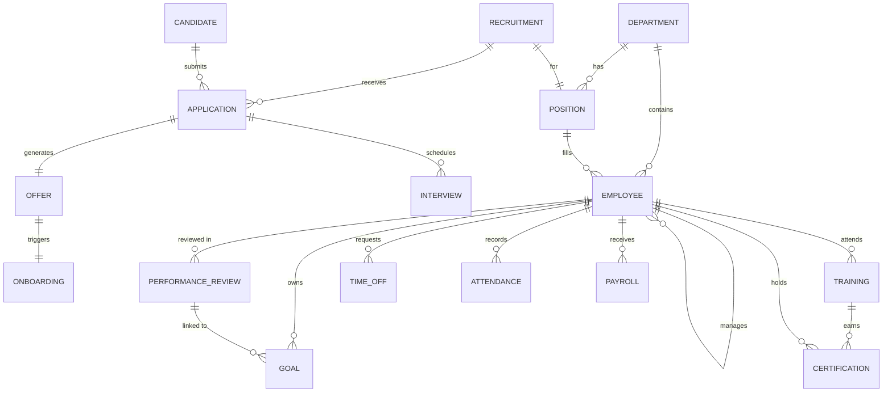

# HR Cloud Subsystem

The **HR Cloud** module manages the complete employee lifecycle from recruitment through retirement. It provides comprehensive Human Capital Management functionality built around the Employee as the central entity.

## 1. Domain Model (Schema)

The subsystem covers six functional areas: Organization, Talent Acquisition, Performance Management, Learning & Development, Time & Attendance, and Compensation.

### 1.1 Core Objects (`packages/hr`)

| Object Name | API Name | Description | Key Fields |
|-------------|----------|-------------|------------|
| **Employee** | `employee` | Core employee master data and information. | `employee_number`, `employment_status`, `department_id`, `position_id`, `manager_id`, `hire_date`, `base_salary` |
| **Department** | `department` | Organizational units and team structure. | `name`, `parent_id`, `manager_id` |
| **Position** | `position` | Job positions and role definitions. | `title`, `department_id`, `level`, `headcount` |
| **Candidate** | `candidate` | Job applicants and prospect tracking. | `status`, `source`, `years_of_experience`, `expected_salary`, `highest_education` |
| **Recruitment** | `recruitment` | Hiring requisitions and job openings. | `position_id`, `department_id`, `status`, `target_hire_date` |
| **Application** | `application` | Candidate-to-requisition linkage. | `candidate_id`, `recruitment_id`, `status`, `stage`, `applied_date` |
| **Interview** | `interview` | Interview scheduling and feedback. | `candidate_id`, `interviewer_id`, `interview_type`, `result`, `scheduled_date` |
| **Offer** | `offer` | Employment offer management. | `offer_number`, `candidate_id`, `base_salary`, `status`, `expiry_date`, `start_date` |
| **Onboarding** | `onboarding` | New hire onboarding workflows. | `employee_id`, `start_date`, `target_completion_date`, `status`, `onboarding_type` |
| **Performance Review** | `performance_review` | Periodic employee evaluations. | `employee_id`, `reviewer_id`, `review_period`, `overall_rating`, `overall_score`, `status` |
| **Goal** | `goal` | OKRs and individual goal tracking. | `employee_id`, `goal_type`, `status`, `progress`, `target_value`, `current_value` |
| **Training** | `training` | Employee training and course management. | `employee_id`, `training_type`, `status`, `completion_percentage`, `exam_score` |
| **Certification** | `certification` | Professional certifications and credentials. | `employee_id`, `issuing_organization`, `issue_date`, `expiry_date`, `status` |
| **Time Off** | `time_off` | Leave requests and PTO management. | `employee_id`, `leave_type`, `start_date`, `end_date`, `status` |
| **Attendance** | `attendance` | Daily attendance and clock-in tracking. | `employee_id`, `date`, `check_in`, `check_out`, `status` |
| **Payroll** | `payroll` | Salary processing and compensation. | `employee_id`, `period`, `base_salary`, `deductions`, `net_pay` |

### 1.2 Relationship Diagram

## 2. Business Logic (Automation)

The business logic layer enforces HR processes and automates employee lifecycle events.

### 2.1 Candidate Scoring & Screening (`candidate.hook.ts`)

- **Trigger**: `beforeInsert`, `beforeUpdate`
- **CandidateScoringTrigger**:
  - Calculates candidate score (0–100) based on weighted factors: Education (25pts), Experience (30pts), Source quality (15pts), Availability (10pts), Profile completeness (20pts).
  - Auto-screens new candidates and advances passing candidates to `Under Review`.
  - Detects duplicate candidates by email.

### 2.2 Candidate Status Lifecycle (`candidate.hook.ts`)

- **Trigger**: `afterUpdate`
- **CandidateStatusChangeTrigger**: Handles transitions between statuses (`New` → `Under Review` → `Interviewing` → `Hired` / `Rejected` / `Withdrawn`). Each transition triggers downstream automations (interview scheduling, offer creation, rejection emails).

### 2.3 Offer Workflow (`offer.hook.ts`)

- **OfferCreationTrigger** (`beforeInsert`): Auto-generates offer number (`OFF-YYYYMM-NNNN`), calculates default 7-day expiry date.
- **OfferApprovalTrigger** (`beforeUpdate`): Manages approval workflow; approved offers advance to `Approved` status with audit trail.
- **OfferStatusChangeTrigger** (`afterUpdate`): On `Accepted` → creates Employee record from candidate data, generates employee number, and initiates onboarding. On `Rejected`/`Expired`/`Withdrawn` → updates candidate and application statuses accordingly.

### 2.4 Employee Lifecycle (`employee.hook.ts`)

- **EmployeeDataValidationTrigger** (`beforeInsert`, `beforeUpdate`): Validates hire/termination date consistency, auto-sets full name.
- **EmployeeOnboardingTrigger** (`afterInsert`): Creates 90-day onboarding record, notifies manager, creates probation goals.
- **EmployeeStatusChangeTrigger** (`afterUpdate`): Handles `Active` → system provisioning, `Terminated` → offboarding record and access revocation, `On Leave` → calendar updates and task reassignment.

### 2.5 Performance Review Workflow (`performance_review.hook.ts`)

- **PerformanceReviewRatingTrigger** (`beforeInsert`, `beforeUpdate`): Calculates weighted overall rating from six component scores (Technical Skills 25%, Leadership 20%, Communication 15%, Teamwork 15%, Initiative 15%, Quality 10%). Auto-advances to `Pending Approval` when 100% complete.
- **PerformanceReviewWorkflowTrigger** (`afterUpdate`): Manages review lifecycle (`Not Started` → `In Progress` → `Pending Approval` → `Approved` → `Completed`). On approval, triggers compensation review for high performers and creates development goals.

## 3. User Experience (UI)

### 3.1 HR Dashboard (`hr_home.dashboard.ts`)

- **Key Metrics**: "Total Headcount", "Open Positions", "Pending Reviews", "Time-to-Hire".
- **Visuals**: Headcount by Department (bar chart), Recruitment Pipeline (funnel), Attrition Rate (trend line).

### 3.2 Organization Chart (`employee.view.ts`)

- **Type**: `hierarchy`
- **Root**: CEO / Top-level manager
- **Card Fields**: `full_name`, `position`, `department`, `employment_status`.

### 3.3 Recruitment Pipeline (`application.view.ts`)

- **Type**: `kanban`
- **Group By**: `stage`
- **Card Fields**: `candidate_name`, `position`, `applied_date`, `source`.

### 3.4 Employee Record Page (`employee.page.ts`)

- **Header**: Employee photo, name, position, department, status badge.
- **Main Tab**: Personal details, employment info, salary.
- **Related Tab**: Performance Reviews, Goals, Training, Certifications, Time Off, Payroll.
- **AI Sidebar**: "Copilot: Career Path Suggestion", "Flight Risk Assessment".

## 4. Security & Access

- **Roles**:
    - `hr_specialist`: View/Edit all employee records, manage recruitment.
    - `hr_manager`: Full access, approve offers, manage payroll.
    - `department_manager`: View team members, conduct reviews, approve time-off.
    - `employee`: View own records, submit time-off requests, self-evaluation.
- **Sharing Rules**:
    - "Salary and compensation data restricted to HR and direct manager."
    - "Performance reviews visible only to the employee, reviewer, and HR."
    - "Candidate data accessible only to hiring team members."
