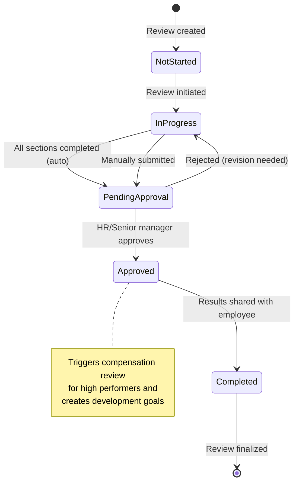

# Performance Management

The Performance Management subsystem provides a structured approach to employee evaluation, goal setting, and professional development. It connects performance reviews to goals, training, and certifications in a unified development cycle.

## 1. Performance Objects

### 1.1 Object Summary

| Object | API Name | Purpose | Key Relationships |
|--------|----------|---------|-------------------|
| **Performance Review** | `performance_review` | Periodic employee evaluations | → Employee (reviewed), Employee (reviewer) |
| **Goal** | `goal` | OKRs and individual targets | → Employee, Performance Review |
| **Training** | `training` | Learning and development courses | → Employee, Certification |
| **Certification** | `certification` | Professional credentials | → Employee, Training |

### 1.2 Performance Review (`performance_review`)

The central evaluation object with multi-dimensional scoring:

- **Participants**: `employee_id` (reviewed employee), `reviewer_id` (typically direct manager)
- **Period**: `review_period` (Quarterly, Semi-Annual, Annual, Probation, Ad-hoc)
- **Type**: `review_type` (Self Review, Manager Review, 360 Review, Probation Review)
- **Timeline**: `start_date`, `end_date`, `due_date`
- **Status**: `Not Started` → `In Progress` → `Pending Review` → `Completed` / `Cancelled`
- **Rating**: `overall_rating` (Outstanding, Exceeds Expectations, Meets Expectations, Needs Improvement, Unsatisfactory)
- **Score**: `overall_score` (0–100, auto-calculated from component ratings)
- **Qualitative**: `achievements`, `strengths`, `areas_for_improvement`, `development_plan`
- **Feedback**: `employee_comments`, `manager_comments`
- **Outcomes**: `promotion_recommendation` (boolean), `salary_increase_recommendation` (percentage)

### 1.3 Goal (`goal`)

OKR-style goal tracking with quantitative progress measurement:

- **Owner**: `employee_id`, `manager_id` (goal setter)
- **Classification**: `goal_type` (Individual, Team, OKR, Development, Project), `category` (Performance, Skill Development, Leadership, Innovation, Teamwork, Customer Satisfaction)
- **Priority**: High, Medium, Low
- **Timeline**: `start_date`, `target_date`, `completion_date`
- **Status**: `Not Started` → `In Progress` → `At Risk` → `Completed` / `Not Achieved` / `Cancelled`
- **Measurement**: `progress` (0–100%), `target_value`, `current_value`, `unit`
- **OKR Support**: `key_results` (free-text key results list)
- **Link**: `performance_review_id`, `weight` (percentage weight in evaluation)

### 1.4 Training (`training`)

Employee learning and development tracking:

- **Type**: Onboarding, Skills Training, Leadership, Compliance, Product, Sales, Safety
- **Category**: Internal, External, Online, Workshop, Conference, Certification
- **Scheduling**: `start_date`, `end_date`, `duration_hours`, `location`, `provider`
- **Status**: `Scheduled` → `In Progress` → `Completed` / `Cancelled` / `No Show`
- **Assessment**: `exam_score` (0–100), `passed` (boolean), `completion_percentage`
- **Cost**: `cost` (currency), `is_mandatory` (boolean)
- **Output**: `certificate_url`, `feedback`, `learning_objectives`

### 1.5 Certification (`certification`)

Professional credential lifecycle management:

- **Details**: `title`, `certification_type` (Professional, Technical, Language, Management, Safety, Compliance)
- **Issuer**: `issuing_organization`, `certification_number`
- **Validity**: `issue_date`, `expiry_date`, `is_active`, `status` (Active, Expiring Soon, Expired, Revoked)
- **Renewal**: `renewal_required`, `next_renewal_date`
- **Link**: `training_id` (if earned through training)
- **Verification**: `certificate_url`, `verification_url`, `score`

## 2. Review Workflow & Approval Process

### 2.1 Review Lifecycle

### 2.2 Rating Calculation

The `PerformanceReviewRatingTrigger` calculates the overall rating from six weighted component scores:

| Component | Weight | Scale |
|-----------|--------|-------|
| Technical Skills | 25% | 1–5 |
| Leadership | 20% | 1–5 |
| Communication | 15% | 1–5 |
| Teamwork | 15% | 1–5 |
| Initiative | 15% | 1–5 |
| Quality of Work | 10% | 1–5 |

**Overall Rating** = Σ (component × weight), mapped to performance level:

| Score Range | Performance Level |
|-------------|-------------------|
| 4.5 – 5.0 | Outstanding |
| 3.5 – 4.4 | Exceeds Expectations |
| 2.5 – 3.4 | Meets Expectations |
| 1.5 – 2.4 | Needs Improvement |
| 1.0 – 1.4 | Unsatisfactory |

### 2.3 Completion Tracking

The system tracks completion percentage based on nine required fields: six component ratings + `achievements` + `areas_for_improvement` + `development_plan`. When completion reaches 100% while in `In Progress` status, the review auto-advances to `Pending Approval`.

## 3. Key Hooks & Automations

### 3.1 Performance Review Rating (`performance_review.hook.ts`)

**PerformanceReviewRatingTrigger** — `beforeInsert`, `beforeUpdate`:

1. Calculates weighted overall rating when all six component scores are present.
2. Determines performance level classification.
3. Calculates completion percentage.
4. Auto-advances status from `In Progress` to `Pending Approval` at 100% completion.

### 3.2 Performance Review Workflow (`performance_review.hook.ts`)

**PerformanceReviewWorkflowTrigger** — `afterUpdate`:

- **→ In Progress**: Sends notification to employee and reviewer.
- **→ Pending Approval**: Sets `submitted_date` and `submitted_by`, notifies approver (HR or senior manager).
- **→ Approved**: Sets `approved_date` and `approved_by`. For `Outstanding` or `Exceeds Expectations` performers, triggers compensation review. Creates development goals from `development_plan` with timeline matching the review period.
- **→ Completed**: Sets `completion_date`, sends results to employee, updates employee record with `last_review_date`, `last_review_rating`, and `last_review_level`.
- **→ Rejected**: Reverts status to `In Progress`, notifies reviewer to revise.

### 3.3 Development Goal Creation

When a review is approved with a non-empty `development_plan`, the system automatically creates a Goal record:

- `goal_name`: `"Development Plan – {review_period} Review"`
- `goal_type`: "Development"
- `description`: Contents of the development plan
- Timeline derived from review period (Quarterly → 3 months, Semi-Annual → 6 months, Annual → 1 year)

### 3.4 Due Date Reminders

The `checkPerformanceReviewDueDates` scheduled function scans for reviews with `Not Started` or `In Progress` status whose `due_date` falls within the next 7 days, and sends reminder notifications to reviewers.

### 3.5 Employee Hooks (`employee.hook.ts`)

- **EmployeeOnboardingTrigger** (`afterInsert`): Creates initial probation goals for new employees with a 90-day timeline.
- **EmployeeStatusChangeTrigger** (`afterUpdate`): On termination, creates offboarding record. On activation, provisions system access.

## 4. AI Integration

### 4.1 Performance Coach Agent

The AI-powered performance coach provides:

- **Review Draft Generation**: Generates initial review drafts based on goal completion data, activity logs, and peer feedback collected during the review period.
- **Goal Recommendation**: Suggests SMART goals based on the employee's role, department objectives, past performance trends, and skill gap analysis.
- **Development Plan Suggestions**: Recommends specific training courses, certifications, and stretch assignments based on `areas_for_improvement` and career path data.
- **Rating Calibration**: Assists managers with rating calibration by showing team-wide and department-wide rating distributions alongside individual scores.

### 4.2 AI-Augmented Analytics

Integration with the `@hotcrm/ai` prediction service:

- **Flight Risk Prediction**: Classification model using features like `last_review_rating`, `salary_percentile`, `tenure`, `promotion_history`, and `engagement_score` to predict attrition risk.
- **Promotion Readiness**: Regression model scoring employees on readiness for next-level roles based on competency scores, goal achievement rate, and training completion.
- **Sentiment Analysis**: NLP model analyzing `employee_comments` and `manager_comments` for sentiment trends across review cycles.
