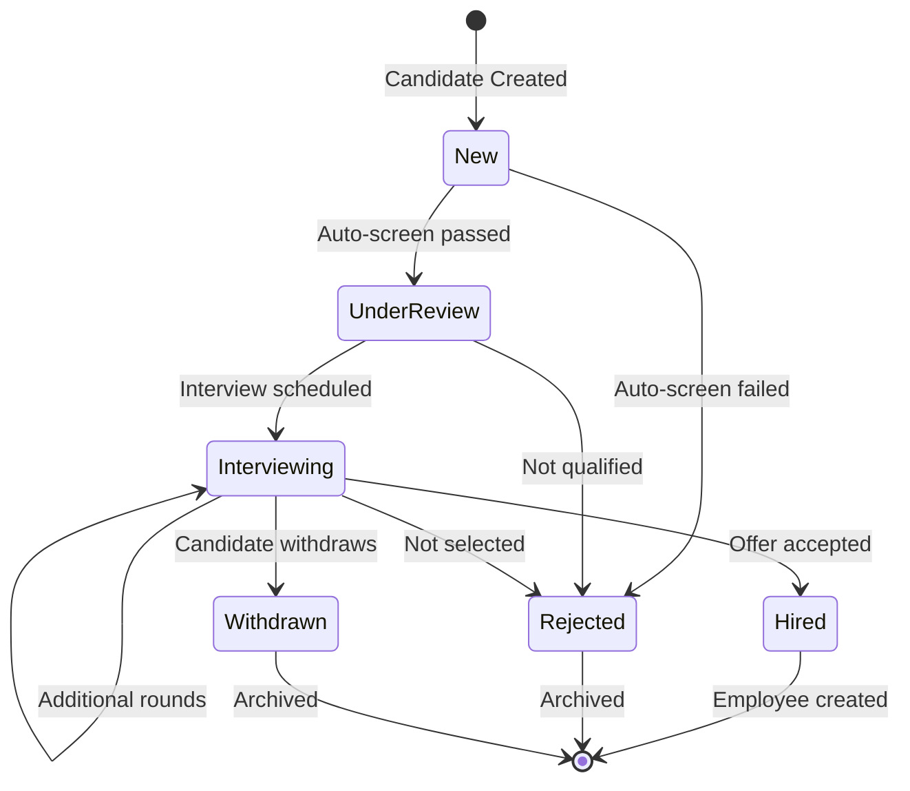
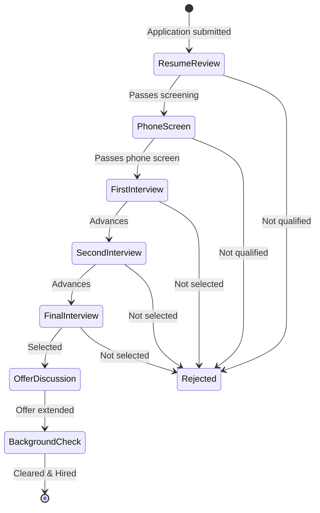

# Recruitment Pipeline

The Recruitment Pipeline manages the end-to-end hiring process from job requisition to employee onboarding. It is built around five core objects that track a candidate's journey through the hiring funnel.

## 1. Recruitment Objects

### 1.1 Object Summary

| Object | API Name | Purpose | Key Relationships |
|--------|----------|---------|-------------------|
| **Candidate** | `candidate` | Prospect/applicant profile | → Application, Interview, Offer |
| **Application** | `application` | Links candidate to a job requisition | → Candidate, Recruitment, Interview |
| **Interview** | `interview` | Individual interview session | → Candidate, Application, Interviewer (Employee) |
| **Offer** | `offer` | Employment offer with compensation | → Candidate, Application, Position, Department |
| **Onboarding** | `onboarding` | New hire integration workflow | → Employee |

### 1.2 Candidate (`candidate`)

The candidate object stores all prospect information. Key fields:

- **Identity**: `first_name`, `last_name`, `email` (unique), `phone`, `mobile_phone`
- **Professional**: `current_company`, `current_title`, `years_of_experience`, `linkedin_url`
- **Education**: `highest_education` (PhD → High School), `university`, `major`
- **Compensation**: `current_salary`, `expected_salary`
- **Logistics**: `notice_period` (Immediate → 3 Months), `source` (Job Board, Employee Referral, Headhunter, Social Media, Campus, Direct Application)
- **Status**: `New` → `Under Review` → `Interviewing` → `Hired` / `Rejected` / `Withdrawn`
- **Tracking**: `resume_url`, `city`, `country`, `notes`

### 1.3 Application (`application`)

Links a candidate to a specific recruitment requisition:

- **References**: `candidate_id`, `recruitment_id`, `referrer_id` (if Employee Referral)
- **Status**: `Submitted` → `Screening` → `Interview Scheduled` → `Interviewing` → `Shortlisted` → `Offer Extended` / `Rejected` / `Withdrawn`
- **Stage Tracking**: `Resume Review` → `Phone Screen` → `First Interview` → `Second Interview` → `Final Interview` → `Offer Discussion` → `Background Check`

### 1.4 Interview (`interview`)

Individual interview sessions with structured feedback:

- **Type**: Phone Screen, Video Interview, First Round, Second Round, Final Round, Technical, HR
- **Scheduling**: `scheduled_date`, `duration` (default 60 min), `location`
- **Panel**: `interviewer_id` (primary), `panel_members` (comma-separated)
- **Status**: `Scheduled` → `Confirmed` → `In Progress` → `Completed` / `Cancelled` / `No Show` / `Rescheduled`
- **Result**: `Strong Hire`, `Hire`, `Maybe`, `No Hire`, `Strong No Hire`
- **Feedback**: `feedback`, `strengths`, `weaknesses`

### 1.5 Offer (`offer`)

Employment offer with compensation details and approval workflow:

- **Identification**: `offer_number` (auto-generated: `OFF-YYYYMM-NNNN`)
- **Compensation**: `base_salary`, `bonus`, `equity`, `benefits`
- **Terms**: `employment_type`, `probation_period`, `start_date`, `expiry_date`
- **Status**: `Draft` → `Pending Approval` → `Extended` → `Accepted` / `Rejected` / `Withdrawn` / `Expired`
- **Approval**: Managed by `OfferApprovalTrigger` with `approved_date` and `approved_by` tracking

## 2. Candidate Lifecycle State Machine

### 2.1 Application Stage Flow

## 3. Key Hooks & Automations

### 3.1 Candidate Scoring (`candidate.hook.ts`)

The `CandidateScoringTrigger` fires on `beforeInsert` and `beforeUpdate` to calculate a composite score:

| Factor | Max Points | Scoring Logic |
|--------|-----------|---------------|
| Education | 25 | PhD=25, Master=20, Bachelor=15, Associate=10, High School=5 |
| Experience | 30 | 10+yr=30, 7yr=25, 5yr=20, 3yr=15, 1yr=10, &lt;1yr=5 |
| Source Quality | 15 | Referral=15, Headhunter=12, Campus=10, Job Board=8, Social=7, Direct=6 |
| Availability | 10 | Immediate=10, 1wk=9, 2wk=8, 1mo=6, 2mo=4, 3mo=2 |
| Profile Completeness | 20 | Proportional to 10 key fields filled |

**Auto-Screening**: New candidates with valid email, phone, and resume automatically advance from `New` to `Under Review`.

**Duplicate Detection**: Before insert, checks for existing candidates with the same email address.

### 3.2 Candidate Status Changes (`candidate.hook.ts`)

The `CandidateStatusChangeTrigger` fires `afterUpdate` when status changes:

- **→ Interviewing**: Schedules first interview, notifies hiring manager.
- **→ Hired**: Creates offer record, initiates onboarding, sends welcome email.
- **→ Rejected**: Sends rejection notification, archives candidate data.
- **→ Withdrawn**: Logs withdrawal reason, updates recruitment metrics.

### 3.3 Offer Creation (`offer.hook.ts`)

The `OfferCreationTrigger` fires `beforeInsert`:

1. Generates sequential offer number: `OFF-{YYYYMM}-{0001..9999}`.
2. Sets default 7-day expiry if not provided.
3. Defaults status to `Draft`.

### 3.4 Offer Approval (`offer.hook.ts`)

The `OfferApprovalTrigger` fires `beforeUpdate`:

- On approval: Sets `approved_date`, `approved_by`, advances status to `Approved`.
- On rejection: Reverts status to `Draft` for revision.

### 3.5 Offer Status Transitions (`offer.hook.ts`)

The `OfferStatusChangeTrigger` fires `afterUpdate`:

- **→ Sent**: Updates candidate status, sets `sent_date`, schedules follow-up.
- **→ Accepted**: Updates candidate to `Hired`, creates Employee record with auto-generated employee number (`EMP{YYYY}{0001..9999}`), copies candidate data (name, email, phone) to employee.
- **→ Rejected**: Updates candidate and application statuses, records rejection date.
- **→ Expired**: Updates candidate status, notifies hiring manager.
- **→ Withdrawn**: Notifies candidate, logs withdrawal reason.

### 3.6 Employee Onboarding (`employee.hook.ts`)

The `EmployeeOnboardingTrigger` fires `afterInsert`:

1. Creates 90-day onboarding record with HR coordinator assignment.
2. Notifies direct manager of new team member.
3. Creates probation goals linked to the onboarding period.

## 4. AI Integration

### 4.1 Recruitment Assistant Agent

The AI-powered recruitment assistant provides:

- **Resume Parsing**: Extract structured data from uploaded resumes to auto-populate candidate fields.
- **Candidate Matching**: Score candidates against job requisition requirements using NLP-based skill matching.
- **Interview Question Generation**: Generate role-specific interview questions based on position requirements and candidate background.
- **Offer Benchmarking**: Compare proposed compensation against market data to ensure competitive offers.

### 4.2 AI-Augmented Screening

Integration with the `@hotcrm/ai` prediction service:

- **Model**: `candidate-fit-scoring` (classification model)
- **Features**: `years_of_experience`, `highest_education`, `source`, `skills_match_score`
- **Output**: Fit probability (0–100) and risk factors
- **Usage**: Supplements the rule-based scoring in `CandidateScoringTrigger` with ML predictions.
