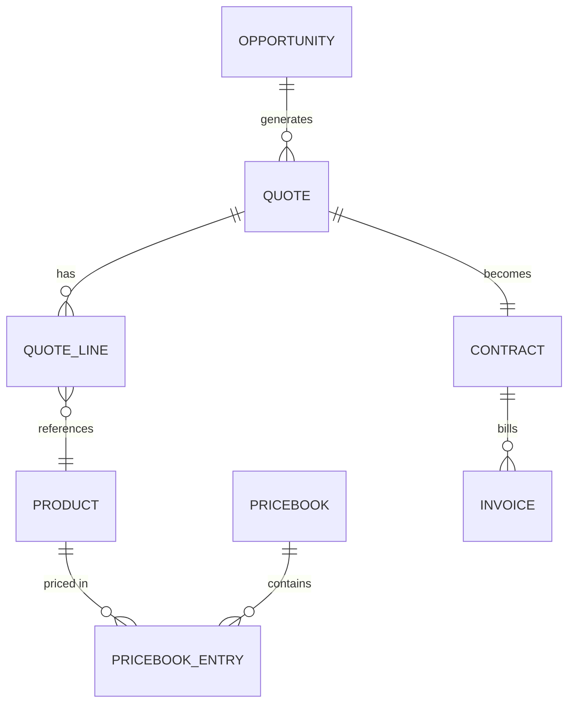

# Revenue Cloud Subsystem

**Revenue Cloud** handles the "Cash" part of "Lead-to-Cash". It ensures accurate pricing, rapid quoting, and seamless billing.

## 1. Domain Model (Schema)

### 1.1 Core Objects (`packages/finance` + `packages/products`)

| Object Name | API Name | Description | Key Fields |
|-------------|----------|-------------|------------|
| **Product** | `product` | The catalog item. | `code`, `is_active`, `family` |
| **Pricebook** | `pricebook` | A list of prices (e.g., USD Standard). | `currency`, `is_standard` |
| **Pricebook Entry** | `pricebook_entry` | Price of Product A in Pricebook B. | `unit_price`, `product_id`, `pricebook_id` |
| **Quote** | `quote` | A formal proposal to a customer. | `opportunity_id`, `expiration_date`, `status`, `grand_total` |
| **Quote Line** | `quote_line_item` | Items on the proposal. | `quantity`, `list_price`, `discount`, `net_price` |
| **Contract** | `contract` | The signed legal agreement. | `account_id`, `start_date`, `term_months` |
| **Invoice** | `invoice` | Bill for payment. | `amount_due`, `due_date`, `status` |

### 1.2 Relationship Diagram

## 2. Business Logic (Automation)

### 2.1 Pricing Engine (`quote.calculate.action.ts`)
Calculates the `net_price` for each line item.
- **Formula**: `Unit Price` - `Volume Discount` - `Partner Discount`.
- **Constraint**: If `discount > 20%`, trigger Approval Process.

### 2.2 Sync to Opportunity (`quote.sync.hook.ts`)
- **Trigger**: `after_update` (When Quote is made "Primary").
- **Logic**: Overwrite `Opportunity.amount` and `OpportunityLineItems` with the Quote's data.

### 2.3 Subscription Renewal (`contract.renew.action.ts`)
- **Trigger**: Schedule (30 days before `end_date`).
- **Logic**: 
    1. Clone the existing Contract.
    2. Apply "Uplift" (e.g., +5% price).
    3. Create new Opportunity "Renewal".

## 3. User Experience (UI)

### 3.1 Quote Builder (`quote_builder.page.ts`)
A specialized UI component (not just a standard form).
- **Product Picker**: Searchable catalog with images.
- **Line Editor**: Excel-like grid for editing Quantities and Discounts.
- **Summary**: Real-time calculation of Grand Total and Margin.

### 3.2 Invoice Generator (`invoice.view.ts`)
- **Action**: "Generate PDF".
- **Template**: Uses `packages/finance/src/templates/invoice.html` with merge fields.

## 4. Security & Access

- **Finance Team**: Full access to Pricebooks, Contracts, Invoices.
- **Sales Rep**: Read Pricebooks, Create Quotes. No access to Invoices.
