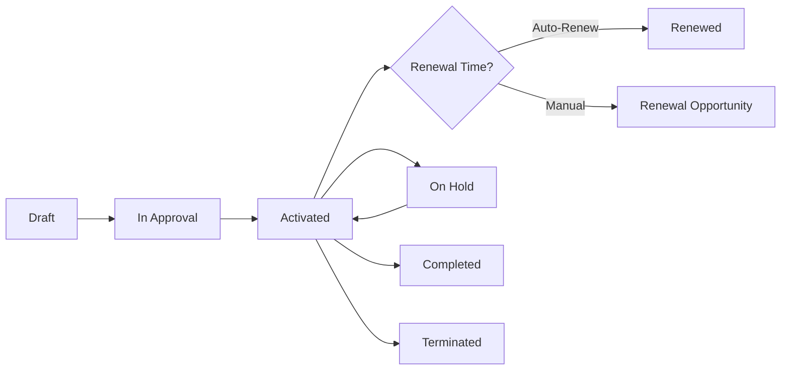

# Contract & Revenue Management

Turn closed deals into executed contracts and predictable revenue. HotCRM helps you manage the entire contract lifecycle from signature to renewal, track payments, and ensure healthy cash flow.

## What You Can Do

<Cards>
  <Card title="Contract Lifecycle" icon="file-signature">
    Manage contracts from draft through renewal or termination
  </Card>
  <Card title="Auto-Renewals" icon="refresh">
    Never miss a renewal with automated reminders and workflows
  </Card>
  <Card title="Revenue Tracking" icon="chart-line">
    Monitor ARR, MRR, and contract value in real-time
  </Card>
  <Card title="Payment Management" icon="credit-card">
    Track invoices, payments, and collections (Coming Q1 2026)
  </Card>
</Cards>

---

## Contract Management

### What is a Contract?

A Contract is a legally binding agreement between you and your customer that defines:
- What you're delivering (products/services)
- How much they're paying
- When payment is due
- Contract duration
- Renewal terms
- Cancellation policy

**Contracts are created from:**
- ✅ Accepted quotes
- ✅ Won opportunities
- ✅ Manual entry (for existing contracts)

---

### Contract Lifecycle



---

### Contract Status

**1. Draft** - Being prepared, not yet legal
- Created from quote or manually
- Terms being negotiated
- Not yet signed
- Can be edited freely

**Example:** Sales rep creates contract from accepted quote, legal team reviews terms.

---

**2. In Approval** - Awaiting internal sign-off
- Submitted for approval
- Legal review in progress
- Finance approval pending
- Cannot be edited without resubmitting

**Example:** $250K contract requires CFO approval before sending to customer.

---

**3. Activated** - Signed and in force
- Fully executed (signed by both parties)
- Services being delivered
- Revenue being recognized
- Renewal tracking active

**Example:** 2-year contract signed on Jan 1, 2026, active through Dec 31, 2027.

---

**4. On Hold** - Temporarily paused
- Customer requested pause
- Payment issues
- Service suspended
- Can be reactivated

**Example:** Customer requests 3-month pause due to internal restructuring.

---

**5. Completed** - Successfully finished
- Contract term ended
- All obligations fulfilled
- Final payment received
- Ready for renewal discussion

**Example:** 1-year contract completed successfully, customer renewing for year 2.

---

**6. Terminated** - Cancelled early
- Customer cancelled
- Non-payment
- Breach of contract
- Mutual agreement to end

**Example:** Customer went out of business, contract terminated after 6 months of 12-month term.

---

### Key Contract Information

**Essential Fields:**

| Field | Description | Example |
|-------|-------------|---------|
| **Contract Number** | Auto-generated ID | CT-2026-0001 |
| **Account** | Customer | TechCorp Inc. |
| **Opportunity** | Related deal | TechCorp - CRM Implementation |
| **Quote** | Source quote | Q-2026-0123 |
| **Status** | Current state | Activated |
| **Start Date** | When it begins | January 1, 2026 |
| **End Date** | When it expires | December 31, 2026 |
| **Contract Term** | Duration (months) | 12 months |
| **Contract Value** | Total value | $75,000 |
| **Billing Frequency** | How often billed | Monthly, Quarterly, Annual |
| **Auto-Renew** | Renew automatically? | Yes/No |
| **Owner** | Contract manager | Sarah Chen |

---

### Contract Numbering

**Professional auto-generated numbers:**

```
Format: CT-YYYY-NNNN

Examples:
- CT-2026-0001 (First contract of 2026)
- CT-2026-0123 (123rd contract of 2026)
- CT-2027-0001 (First contract of 2027)
```

**Benefits:**
- Unique identifier
- Easy to reference
- Year-based organization
- Sequential tracking

---

### Creating Contracts

#### Method 1: From Accepted Quote (Recommended)

```
1. Quote accepted by customer
2. Click "Create Contract"
3. System auto-populates:
   ✅ Account and Opportunity
   ✅ Contract value from quote
   ✅ Products/line items
   ✅ Terms and conditions
4. Set start/end dates
5. Configure billing frequency
6. Set auto-renew preference
7. Submit for approval (if required)
8. Send for signature
9. Activate when signed
```

**Why this is best:**
- No data re-entry
- Ensures quote and contract match
- Maintains complete audit trail
- Faster execution

---

#### Method 2: From Won Opportunity

```
1. Opportunity reaches "Closed Won"
2. Click "Create Contract"
3. Enter contract details manually:
   - Contract value
   - Start and end dates
   - Billing terms
4. Submit for approval
5. Activate
```

**When to use:**
- Simple deals without formal quote
- Verbal agreements
- Renewals of existing contracts

---

#### Method 3: Manual Entry

```
1. Go to Contracts
2. Click "New Contract"
3. Fill in all details
4. Attach supporting documents
5. Activate
```

**When to use:**
- Migrating existing contracts into CRM
- Historical contracts for tracking
- Partner or vendor contracts

---

### Contract Terms & Billing

#### Billing Frequency

**Monthly** - Billed every month
```
Contract Value: $12,000/year
Billing: $1,000/month
Payment: Due on 1st of each month
```

**Quarterly** - Billed every 3 months
```
Contract Value: $12,000/year
Billing: $3,000/quarter
Payment: Due Jan 1, Apr 1, Jul 1, Oct 1
```

**Annual** - Billed once per year
```
Contract Value: $12,000/year
Billing: $12,000 upfront or on anniversary
Payment: Due on contract start date
```

**Custom** - Flexible payment schedule
```
Contract Value: $24,000 (2 years)
Billing: 
  - $8,000 upfront
  - $8,000 at month 6
  - $8,000 at month 12
```

---

#### Contract Terms (Duration)

**Standard Terms:**
- **Month-to-Month** - No commitment, cancel anytime
- **12 Months** - 1-year commitment (most common)
- **24 Months** - 2-year commitment (discount offered)
- **36 Months** - 3-year commitment (best pricing)

**Multi-Year Benefits:**
```
1-Year: $1,000/month ($12,000/year)
2-Year: $900/month ($10,800/year) - Save 10%
3-Year: $800/month ($9,600/year) - Save 20%
```

---

## Contract Renewals

### Why Renewals Matter

**Business Impact:**
- Retention is cheaper than new acquisition (5-7x)
- Renewals are predictable revenue
- Expansion opportunities (upsell/cross-sell)
- Customer lifetime value (LTV) growth

**Industry Benchmarks:**
- SaaS Renewal Rate: 85-95%
- Lost renewal = lost ARR + future expansion
- Renewals should be 30-50% of new revenue

---

### Auto-Renewal

**How it works:**
```
Contract: TechCorp - Annual CRM License
Start Date: Jan 1, 2026
End Date: Dec 31, 2026
Auto-Renew: Yes
Renewal Reminder: 90 days before expiration

Timeline:
- Oct 2, 2026: Auto-reminder sent to customer
  "Your contract renews in 90 days"
  
- Nov 1, 2026: Follow-up reminder (60 days)
  "Renews in 60 days - review and confirm"
  
- Dec 1, 2026: Final reminder (30 days)
  "Renews in 30 days - last chance to make changes"
  
- Dec 31, 2026: Contract auto-renews
  New contract created: CT-2027-0001
  New end date: Dec 31, 2027
```

**Auto-Renew Best Practices:**

✅ **Do:**
- Send multiple reminders (90, 60, 30 days)
- Allow customers to update or cancel easily
- Price lock for auto-renewals
- Offer incentives for early commitment

❌ **Don't:**
- Auto-renew without notice
- Surprise price increases
- Make cancellation difficult
- Lock customers in unfairly

---

### Manual Renewal Process

**For contracts without auto-renew:**

```
90 Days Before Expiration:
□ Create renewal opportunity
□ Schedule renewal call with customer
□ Review usage and satisfaction
□ Identify expansion opportunities

60 Days Before:
□ Present renewal quote
□ Include any upgrades/expansions
□ Offer multi-year incentive
□ Request verbal commitment

30 Days Before:
□ Send contract for signature
□ Follow up on approval delays
□ Address any concerns
□ Confirm renewal

At Expiration:
□ Activate new contract
□ Update subscription/access
□ Send welcome email for new term
□ Schedule QBR (Quarterly Business Review)
```

---

### Renewal Opportunities

**Track renewals as opportunities:**

```
Opportunity: TechCorp - 2027 Renewal
Type: Renewal
Account: TechCorp Inc.
Current Contract Value: $75,000
Proposed Renewal Value: $90,000
Expansion:
  + 10 additional users ($10,000)
  + Premium support upgrade ($5,000)

Close Date: December 31, 2026
Probability: 95%
Status: Verbal commitment received
```

**Why track as opportunities:**
- Forecast renewal revenue
- Identify at-risk renewals early
- Track expansion revenue separately
- Manage renewal sales process

---

### At-Risk Renewals

**Warning Signs:**

🚨 **Red Flags:**
- Low product usage (not logging in)
- Multiple open support cases
- Complaints or dissatisfaction
- Executive sponsor left company
- No response to outreach
- Exploring competitors

**Risk Levels:**

**High Risk (🔴)** - Likely to churn
- Health score: &lt;40
- No engagement in 90+ days
- Negative feedback
- Budget cuts announced

**Action:** Executive intervention, discount offer, win-back plan

**Medium Risk (🟡)** - Could go either way
- Health score: 40-60
- Low engagement
- Mixed feedback
- Price-shopping

**Action:** Business review, prove ROI, address concerns

**Low Risk (🟢)** - Likely to renew
- Health score: 60+
- Active usage
- Positive feedback
- Expansion discussions

**Action:** Standard renewal process, propose expansion

---

## Revenue Tracking

### Key Metrics

**Annual Recurring Revenue (ARR)**
```
Total value of all annual contracts

Example:
- 100 customers at $10,000/year = $1,000,000 ARR

Calculation:
Sum of all active annual contract values
```

**Monthly Recurring Revenue (MRR)**
```
ARR ÷ 12 = MRR

Example:
$1,000,000 ARR ÷ 12 = $83,333 MRR
```

**Customer Lifetime Value (LTV)**
```
Average contract value × Average retention years

Example:
$10,000/year × 5 years average = $50,000 LTV
```

**Churn Rate**
```
Lost customers ÷ Total customers × 100%

Example:
Lost 5 customers out of 100
Churn Rate = 5%

Target: &lt;5% annual churn (SaaS)
```

**Revenue Retention**
```
Renewal revenue ÷ Expiring revenue × 100%

Example:
$900K renewals from $1M expiring
Retention = 90%

Target: >100% (including expansions)
```

---

### Revenue Forecasting

**Predictable Revenue Components:**

**1. Existing ARR** (Most certain)
```
Current active contracts: $1,000,000
Expected renewal rate: 90%
Forecasted renewals: $900,000
```

**2. Expansion Revenue** (High confidence)
```
Upsell opportunities in pipeline: $150,000
Expected win rate: 70%
Forecasted expansion: $105,000
```

**3. New Business** (Moderate confidence)
```
New opportunities in pipeline: $500,000
Expected win rate: 25%
Forecasted new revenue: $125,000
```

**Total Forecast:**
```
Renewals: $900,000
Expansion: $105,000
New: $125,000
---
Total ARR: $1,130,000 (13% growth)
```

---

## Payment Management (Planned - Q1 2026)

### Invoice Generation

**Automatic invoicing:**
```
Contract: TechCorp Annual License
Billing: Quarterly ($3,000)

Invoices Generated:
- Invoice #INV-2026-0001: Jan 1 ($3,000)
- Invoice #INV-2026-0002: Apr 1 ($3,000)
- Invoice #INV-2026-0003: Jul 1 ($3,000)
- Invoice #INV-2026-0004: Oct 1 ($3,000)

Each includes:
✅ Contract reference
✅ Line items
✅ Payment terms (Net 30)
✅ Payment methods
✅ Tax calculation
```

---

### Payment Tracking

**Payment Status:**
- **Scheduled** - Invoice not yet sent
- **Sent** - Invoice sent to customer
- **Paid** - Payment received ✅
- **Overdue** - Past due date 🔴
- **Partially Paid** - Partial payment received
- **Cancelled** - Invoice cancelled

**Example:**
```
Invoice #INV-2026-0001
Amount: $3,000
Due Date: January 31, 2026
Status: Paid ✅
Paid Date: January 28, 2026
Payment Method: ACH Transfer
```

---

### Collections Management

**Overdue Workflow:**
```
Day 0: Invoice due date
  No action, grace period

Day 1: Overdue
  Auto-reminder email sent

Day 7: 7 days overdue
  Follow-up email + phone call

Day 14: 14 days overdue
  Escalate to manager
  Final notice before service suspension

Day 30: 30 days overdue
  Suspend service access
  Engage collections agency (if applicable)
  Consider contract termination
```

**Best Practices:**
✅ Friendly reminders before due date
✅ Multiple payment options (credit card, ACH, wire)
✅ Automated payment processing
✅ Clear escalation procedures
✅ Maintain customer relationship while collecting

---

## Contract Analytics

### Key Reports

**1. Contract Value by Status**
```
Active Contracts: $2,500,000 (85%)
Expiring This Quarter: $300,000 (10%)
Terminated: $150,000 (5%)
```

**2. Renewal Pipeline**
```
Expiring in 30 days: $100,000
Expiring in 60 days: $150,000
Expiring in 90 days: $200,000
Renewal probability: 90% average
```

**3. Revenue by Billing Type**
```
Annual: $1,500,000 (60%)
Quarterly: $750,000 (30%)
Monthly: $250,000 (10%)
```

**4. Contract Term Distribution**
```
Month-to-Month: 15%
1-Year: 65%
2-Year: 15%
3-Year: 5%
```

---

## Best Practices

### For Sales Teams

✅ **Create Contracts Promptly**
- Convert won deals to contracts immediately
- Don't let deals languish after close
- Get signatures fast (strike while hot)

✅ **Track Renewals Proactively**
- Start renewal conversations 90 days early
- Build relationships, not just transact
- Always look for expansion opportunities

✅ **Document Everything**
- Attach signed contracts
- Note verbal commitments
- Keep complete history
- Maintain audit trail

---

### For Finance Teams

✅ **Monitor Cash Flow**
- Track payment schedules
- Follow up on overdue invoices
- Forecast revenue accurately
- Manage payment methods

✅ **Revenue Recognition**
- Recognize revenue according to terms
- Track deferred revenue
- Comply with accounting standards (ASC 606)
- Reconcile contracts to payments

---

### For Customer Success

✅ **Own the Renewal**
- Ensure customer success throughout term
- Monitor health scores
- Address issues proactively
- Build case for renewal

✅ **Drive Expansion**
- Identify upsell opportunities
- Prove ROI continuously
- Understand customer roadmap
- Align with their growth

---

## Common Workflows

### Workflow 1: Quote to Contract

```
1. Customer accepts quote
   Status: Quote Accepted ✅

2. Sales rep clicks "Create Contract"
   System auto-fills contract details

3. Contract review
   Legal team reviews terms

4. Contract approval
   Finance approves pricing

5. Send for signature
   DocuSign sent to customer

6. Customer signs
   Contract fully executed

7. Activate contract
   Status: Activated
   Start date: Today

8. Generate first invoice
   Send to customer accounting

9. Handoff to customer success
   Implementation kickoff scheduled
```

---

### Workflow 2: Contract Renewal

```
90 Days Before Expiration:

1. Auto-reminder triggers
   Email to customer + account owner

2. Customer success review
   Check health score and usage

3. Create renewal opportunity
   Quote prepared with any changes

60 Days Before:

4. Renewal call scheduled
   Review value, address concerns

5. Quote presented
   Include expansion if applicable

30 Days Before:

6. Contract sent for signature
   Same terms or negotiated updates

7. Customer signs
   New contract activated

8. Old contract status → Completed
   New contract → Activated
```

---

## Roadmap: Planned Features

### Q1 2026
- 🚧 **Payment Processing** - Invoice generation and payment tracking
- 🚧 **E-Signature Integration** - DocuSign/Adobe Sign native integration
- 🚧 **Automated Collections** - Overdue payment workflows

### Q2 2026
- 🚧 **Subscription Management** - Recurring billing and auto-renewals
- 🚧 **Revenue Recognition** - ASC 606 compliant revenue scheduling
- 🚧 **Contract Templates** - Legal-approved contract templates

### Q3 2026
- 🚧 **Contract AI** - AI-powered contract review and risk analysis
- 🚧 **Multi-Currency** - Global contract and payment support
- 🚧 **Payment Methods** - Credit card, ACH, wire transfer integration

---

## Success Metrics

**Impact of Contract Management:**
- ⬆️ 95%+ contract renewal rate
- ⬆️ 25% increase in multi-year commitments
- ⬆️ 40% faster contract execution (days → hours)
- ⬇️ 75% reduction in manual invoicing
- ⬆️ 99% on-time payment collection
- ⬆️ 30% increase in expansion revenue

---

## Getting Started

<Cards>
  <Card title="Create Your First Contract" href="/docs/guides/contract-creation">
    Learn to create contracts from quotes
  </Card>
  <Card title="Set Up Auto-Renewals" href="/docs/guides/auto-renewals">
    Configure renewal reminders and automation
  </Card>
  <Card title="Track Revenue" href="/docs/guides/revenue-tracking">
    Monitor ARR, MRR, and contract value
  </Card>
  <Card title="Renewal Playbook" href="/docs/guides/renewal-playbook">
    Best practices for maximizing renewals
  </Card>
</Cards>

---

## Related Topics

- [Sales Automation](/docs/features/sales-automation) - Close deals to create contracts
- [Product & Quote Management](/docs/features/product-pricing) - Generate quotes that become contracts
- [Customer Service](/docs/features/customer-service) - Link support to contracts and SLAs
- [API Reference](/docs/api-reference/rest-api) - Contract management API
