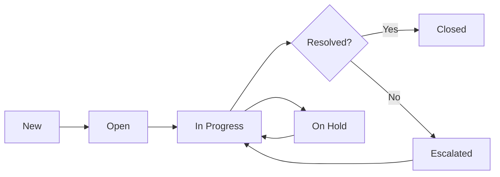

# Customer Service & Support

Transform your customer support into a competitive advantage. HotCRM helps you deliver fast, personalized support across all channels, track SLAs automatically, and empower customers with self-service knowledge.

## What You Can Do

<Cards>
  <Card title="Omni-Channel Support" icon="messages">
    Handle cases from email, web, phone, social media, and chat
  </Card>
  <Card title="SLA Management" icon="clock">
    Track and enforce response and resolution times automatically
  </Card>
  <Card title="Knowledge Base" icon="book">
    Empower customers with self-service articles and AI search
  </Card>
  <Card title="Smart Routing" icon="route">
    Auto-assign cases to the right team based on skills and availability
  </Card>
</Cards>

---

## Case Management

### What is a Case?

A Case represents a customer support request, issue, or question. Cases are the central object for tracking all customer service interactions.

---

### Support Channels

HotCRM captures cases from multiple channels:

#### 📧 Email-to-Case
**How it works:**
- Customer sends email to support@yourcompany.com
- Case created automatically
- Email thread becomes case comments
- Replies sent from CRM tracked in case history

**Best for:** Detailed inquiries, documentation needs, async support

---

#### 🌐 Web-to-Case
**How it works:**
- Customer fills web form on your website
- Case created with form data
- Confirmation email sent automatically
- Auto-assignment rules apply

**Best for:** Common issues, first-time customers, structured intake

---

#### 📱 Social Media
**Channels supported:**
- Twitter/X mentions and DMs
- Facebook messages and comments
- LinkedIn messages
- WeChat conversations

**How it works:**
- Social mentions create cases automatically
- Public responses via social platform
- Private details handled in case
- Sentiment analysis applied

**Best for:** Public issues, reputation management, quick questions

---

#### ☎️ Phone Support
**How it works:**
- Agent creates case during call
- Call duration and notes logged
- Auto-populate customer info
- Link to account/contact

**Best for:** Complex issues, urgent requests, high-value customers

---

#### 💬 Live Chat
**How it works:**
- Chat widget on your website
- Real-time conversation
- Case created from chat transcript
- Seamless handoff to email if needed

**Best for:** Simple questions, sales inquiries, immediate needs

---

#### 📲 Mobile App
**How it works:**
- Customers submit cases via mobile app
- Attachment support (photos, screenshots)
- Push notifications for updates
- In-app messaging

**Best for:** Field issues, visual problems, on-the-go customers

---

### Case Information

**Essential Fields:**

| Field | Description | Example |
|-------|-------------|---------|
| **Case Number** | Auto-generated ID | CASE-2026-0001 |
| **Subject** | Brief description | "Unable to login to account" |
| **Description** | Detailed problem | "Getting error 500 when trying to login..." |
| **Status** | Current state | Open, In Progress, Escalated, Closed |
| **Priority** | Urgency level | Critical, High, Medium, Low |
| **Type** | Case category | Problem, Question, Feature Request |
| **Origin** | How created | Email, Web, Phone, Social Media |
| **Account** | Customer company | TechCorp Inc. |
| **Contact** | Person reporting | Sarah Chen |
| **Product** | Affected product | HotCRM Enterprise |
| **Owner** | Assigned agent | John Smith |

---

### Case Status Lifecycle



**Status Definitions:**

1. **New** - Just created, awaiting assignment
2. **Open** - Assigned to agent, not yet started
3. **In Progress** - Agent actively working on it
4. **Escalated** - Escalated to higher tier or management
5. **On Hold** - Waiting for customer response or external dependency
6. **Closed** - Resolved and confirmed by customer

---

### Priority Levels

**🔴 Critical** - System down, business stopped
- **Response SLA:** 1 hour
- **Resolution SLA:** 4 hours
- **Who:** P1 on-call team
- **Example:** "Production database is down"

**🟠 High** - Major functionality impaired
- **Response SLA:** 4 hours
- **Resolution SLA:** 1 business day
- **Who:** Senior support engineers
- **Example:** "Payment processing failing for all customers"

**🟡 Medium** - Minor issue, workaround available
- **Response SLA:** 8 hours
- **Resolution SLA:** 3 business days
- **Who:** Standard support team
- **Example:** "Report export not working, manual export possible"

**🟢 Low** - General question, minor inconvenience
- **Response SLA:** 24 hours
- **Resolution SLA:** 5 business days
- **Who:** Junior support agents
- **Example:** "How do I change my email signature?"

---

### Case Types

**Problem** - Something isn't working correctly
- Bug reports
- System errors
- Performance issues

**Question** - Customer needs information
- How-to questions
- Best practices
- Product guidance

**Feature Request** - Customer wants new functionality
- Enhancement ideas
- Integration requests
- Workflow improvements

**Incident** - Service disruption
- Outages
- Security incidents
- Data issues

---

## SLA Management (Service Level Agreements)

### What is an SLA?

An SLA defines the response and resolution times you commit to based on customer tier and case priority.

---

### SLA Tiers

**Platinum** (Enterprise customers)
- Critical: 1hr response / 4hr resolution
- High: 2hr response / 8hr resolution
- Medium: 4hr response / 1 day resolution
- Low: 8hr response / 2 day resolution
- Business Hours: 24/7
- Dedicated support engineer

**Gold** (Premium customers)
- Critical: 2hr response / 8hr resolution
- High: 4hr response / 1 day resolution
- Medium: 8hr response / 2 day resolution
- Low: 1 day response / 3 day resolution
- Business Hours: 24/5
- Priority queue

**Silver** (Standard customers)
- Critical: 4hr response / 1 day resolution
- High: 8hr response / 2 day resolution
- Medium: 1 day response / 3 day resolution
- Low: 2 day response / 5 day resolution
- Business Hours: Business hours only

**Bronze/Standard** (Free customers)
- Self-service only
- Community forum support
- Best-effort response times

---

### SLA Tracking

**Automatic Calculations:**
- **Response Due:** When first response is required
- **Resolution Due:** When case must be resolved
- **Time Remaining:** Countdown to SLA breach
- **Business Hours:** Respects holidays and business hours

**Example:**
```
Case: CASE-2026-0123
Priority: High
SLA Tier: Gold
Origin: Email
Created: Monday 9:00 AM

SLA Commitments:
- Response Due: Monday 1:00 PM (4 hours)
- Resolution Due: Tuesday 9:00 AM (1 business day)

Current Status:
- First Response: Monday 10:30 AM ✅ (1.5 hrs - Met SLA)
- Resolution: Tuesday 8:45 AM ✅ (23.75 hrs - Met SLA)
```

---

### SLA Breach Warnings

**Proactive Alerts:**
- 🟡 Warning at 75% of SLA time
- 🟠 Alert at 90% of SLA time
- 🔴 Breach notification if exceeded

**Escalation Actions:**
- Notify team manager
- Auto-escalate to senior agent
- Trigger executive notification (for critical)

---

### Business Hours & Holidays

**Configure business hours by timezone:**
```
US Support Team:
- Mon-Fri: 6:00 AM - 6:00 PM PST
- Sat-Sun: Closed

EU Support Team:
- Mon-Fri: 8:00 AM - 6:00 PM GMT
- Sat-Sun: Closed

APAC Support Team:
- Mon-Fri: 9:00 AM - 6:00 PM SGT
- Sat-Sun: Closed
```

**Holiday Calendars:**
- US Holidays (Thanksgiving, July 4th, etc.)
- EU Holidays (Christmas, Bank Holidays)
- APAC Holidays (Lunar New Year, etc.)

**SLA Calculation:**
Only business hours count toward SLA time!

---

## Queue-Based Routing

### What is a Queue?

A Queue is a holding area for cases that need to be assigned to the right support team.

**Common Queues:**
- **Tier 1 Support** - First-line support for general questions
- **Tier 2 Technical** - Advanced technical issues
- **Billing & Accounts** - Payment and account questions
- **Product Feedback** - Feature requests and enhancement ideas
- **Escalations** - Escalated or complex cases
- **VIP Support** - Enterprise customer support

---

### Auto-Assignment Rules

Cases are automatically routed based on:

**1. Origin-Based Routing**
```
Email to billing@company.com → Billing Queue
Email to support@company.com → General Support Queue
Web form (Technical Issue) → Tier 2 Technical Queue
Social Media → Social Media Queue
```

**2. Skill-Based Routing**
```
Case Type: API Integration Issue
Required Skill: API Expertise
→ Assign to agent with "API Integration" skill
```

**3. Priority-Based Routing**
```
Priority: Critical
SLA Tier: Platinum
→ Assign to Senior Engineer + Notify Manager
```

**4. Language-Based Routing**
```
Customer Language: Spanish
→ Assign to Spanish-speaking agent
```

**5. Round-Robin Routing**
```
General Support Queue
→ Distribute evenly across available agents
```

---

### Queue Management

**Queue Views:**
- **My Cases** - Cases assigned to me
- **Team Queue** - Cases awaiting assignment
- **Escalated** - Cases escalated to our team
- **Due Today** - Cases with SLA due today
- **Overdue** - SLA breached cases (🔴 red alert!)

**Agent Availability:**
- Online / Available
- Busy / In Meeting
- Out of Office
- Away / Break

**Workload Balancing:**
```
Agent Status:
- John Smith: 5 open cases (Available)
- Mary Johnson: 8 open cases (Busy)
- Tom Wilson: 12 open cases (Overdue)

Next case assigned to: John Smith ✅
```

---

## Knowledge Base

### What is a Knowledge Base?

A Knowledge Base is a self-service library of articles, guides, and FAQs that help customers solve problems without contacting support.

---

### Article Types

**How-To Guides** - Step-by-step instructions
- "How to reset your password"
- "How to export data to CSV"
- "How to integrate with Salesforce"

**Troubleshooting** - Problem solving guides
- "Why am I getting error 500?"
- "App won't load - troubleshooting steps"
- "Email delivery issues"

**FAQ** - Frequently asked questions
- "What browsers are supported?"
- "How much does it cost?"
- "Can I cancel anytime?"

**Product Documentation** - Feature explanations
- "Understanding opportunity stages"
- "Sales forecasting guide"
- "User permissions and roles"

**Release Notes** - What's new
- "January 2026 release notes"
- "New features this month"
- "Bug fixes and improvements"

---

### Article Metadata

**Organize for easy discovery:**

| Field | Purpose | Example |
|-------|---------|---------|
| **Title** | Clear, descriptive | "How to Reset Your Password" |
| **Summary** | Brief overview | "Step-by-step guide to reset forgotten password" |
| **Category** | Grouping | Account Management, Billing, Technical |
| **Product** | Relevant product | HotCRM, HotCRM Mobile |
| **Version** | Applicable versions | v1.0+, All Versions |
| **Difficulty** | Complexity | Beginner, Intermediate, Advanced |
| **Est. Time** | Time to complete | 2 minutes, 10 minutes |

---

### AI-Powered Knowledge Search

**Smart Search Features:**
- **Natural Language** - "how do i reset password" finds relevant articles
- **Synonym Matching** - "remove" finds "delete" articles
- **Question Detection** - Recognizes questions vs. keywords
- **Popular Articles** - Frequently viewed articles surfaced first
- **Related Articles** - "People also viewed" suggestions

**Example Search:**
```
Customer types: "can't log in"

AI Suggests:
1. How to Reset Your Password ⭐ (Most Popular)
2. Troubleshooting Login Issues
3. Browser Compatibility Guide
4. Enable Two-Factor Authentication
5. Contact Support (if none of above help)
```

---

### Knowledge-Assisted Case Resolution

**Suggested Articles While Creating Case:**
```
Customer typing description: "I can't log into my account. Getting error message..."

AI Suggestion Panel:
💡 Before submitting, try these articles:
1. Troubleshooting Login Issues (90% match)
2. How to Reset Your Password (85% match)
3. Clear Browser Cache and Cookies (75% match)

[These articles helpful?] [Submit Case Anyway]
```

**Agent View:**
```
Case: "Customer can't login"

Recommended Knowledge:
📄 How to Reset Your Password
📄 Common Login Error Messages
📄 Account Lockout Policy

[Attach Article to Case] [Send to Customer]
```

---

## Community & Self-Service Portal

### Customer Portal

**What customers can do:**
- Submit and track cases
- Search knowledge base
- View contract and subscription info
- Update contact information
- Download invoices
- Access support history

---

### Community Forum

**Forum Structure:**
```
Product Categories:
├── Getting Started
├── Sales & CRM
├── Marketing Automation
├── Customer Service
└── Integrations

Discussion Types:
├── Questions - Ask the community
├── Ideas - Feature requests
├── Problems - Report issues
└── Praise - Success stories
```

**Community Roles:**
- **Customers** - Ask questions, share experiences
- **Champions** - Power users, earn badges
- **Moderators** - Employee moderators
- **Experts** - Verified subject matter experts

**Gamification:**
- Points for helpful answers
- Badges for achievements
- Leaderboards
- Expert status

---

## Agent Tools & Productivity

### Case Console

**Unified Interface:**
- Case details and history
- Customer account summary
- Related cases and contracts
- Knowledge base panel
- Quick actions (close, escalate, reassign)
- Email templates
- Macros for common responses

---

### Canned Responses (Macros)

**Pre-written templates for common scenarios:**

**Password Reset Response:**
```
Hi [First Name],

I understand you're having trouble logging in. No problem!

Please follow these steps to reset your password:
1. Go to https://app.hotcrm.com/forgot-password
2. Enter your email address
3. Check your email for reset link
4. Click link and create new password

If you don't receive the email within 5 minutes, please check your spam folder.

Let me know if you need any further assistance!

Best regards,
[Agent Name]
```

**Closing Case - Issue Resolved:**
```
Hi [First Name],

Great news! I've resolved the issue with [problem description].

[Resolution details]

I'm marking this case as closed. If you experience any further issues or have additional questions, please don't hesitate to reach out.

Thank you for using HotCRM!

Best regards,
[Agent Name]
```

---

### Collaboration Tools

**Internal Case Comments:**
- Private notes visible only to agents
- Tag teammates for input
- Document troubleshooting steps
- Share solutions

**Case Transfer:**
```
Transfer Reason: Needs API Expertise
From: Tier 1 Support Queue
To: Technical Support Queue
Note to Receiving Agent:
"Customer needs help with webhook configuration. I verified 
basic setup but webhook isn't triggering. Logs attached."
```

**Team Chat Integration:**
```
🔔 New case assigned: CASE-2026-0123
Priority: High | Customer: TechCorp
Issue: API integration failing
[View Case] [Claim] [Reassign]
```

---

## Customer Satisfaction (CSAT)

### Post-Case Surveys

**Automatic survey after case closure:**
```
How would you rate your support experience?

😊 Excellent  🙂 Good  😐 Okay  ☹️ Poor

Specific Feedback:
- Was the agent knowledgeable?
- Was your issue resolved?
- How was the response time?
- Would you recommend our support?

Additional Comments: [Text box]
```

**CSAT Metrics:**
- **Score:** % of "Excellent" or "Good" ratings
- **Target:** >90% CSAT for all cases
- **Tracking:** By agent, queue, case type, product

---

### Net Promoter Score (NPS)

**Quarterly NPS Survey:**
```
On a scale of 0-10, how likely are you to recommend 
HotCRM to a colleague or peer?

0 - 1 - 2 - 3 - 4 - 5 - 6 - 7 - 8 - 9 - 10
Not at all likely          Extremely likely

[Submit]
```

**NPS Calculation:**
- **Promoters (9-10):** Enthusiastic, will recommend
- **Passives (7-8):** Satisfied but not enthusiastic
- **Detractors (0-6):** Unhappy, may churn

```
NPS = % Promoters - % Detractors

Example:
60% Promoters, 10% Detractors
NPS = 60 - 10 = 50 (Excellent!)
```

---

## AI-Powered Support Features

### 1. Auto-Suggest Solutions

AI analyzes case description and suggests:
- Relevant knowledge articles
- Similar resolved cases
- Recommended troubleshooting steps

### 2. Sentiment Analysis

AI detects customer emotion:
- 😊 Happy, satisfied
- 😐 Neutral
- 😟 Frustrated
- 😡 Angry → Auto-escalate

### 3. Smart Case Categorization

AI automatically:
- Assigns case type
- Sets priority based on keywords
- Suggests product affected
- Recommends initial queue

### 4. Chatbot (First-Line Support)

AI chatbot handles:
- Common questions
- Knowledge base search
- Password resets
- Case status updates
- Escalate to human when needed

---

## Best Practices

### For Support Agents

✅ **Respond Quickly**
- Acknowledge all new cases within SLA
- Even if you don't have the answer yet
- Set expectations on resolution time

✅ **Be Empathetic**
- Use customer's name
- Acknowledge frustration
- Show you care about their problem

✅ **Communicate Clearly**
- Avoid jargon
- Provide step-by-step instructions
- Use screenshots when helpful

✅ **Follow Through**
- Keep customer updated on progress
- Don't ghost customers
- Confirm issue is truly resolved

✅ **Use Knowledge Base**
- Link to relevant articles
- Contribute new articles for recurring issues
- Keep articles up to date

---

### For Support Managers

✅ **Monitor SLAs**
- Daily review of approaching SLA breaches
- Address systemic delays
- Adjust staffing to match volume

✅ **Track Agent Performance**
- CSAT scores by agent
- Average resolution time
- First contact resolution rate
- Case volume handled

✅ **Identify Trends**
- Common case types
- Product areas with most issues
- Customer pain points
- Knowledge gaps

✅ **Continuous Improvement**
- Weekly team training
- Share best practices
- Review difficult cases
- Update processes

---

## Common Workflows

### Workflow 1: New Case from Email

```
1. Customer emails support@company.com
2. Email-to-Case creates case automatically
   - Subject from email
   - Description from body
   - Contact matched by email address
3. Routing rules assign to queue
4. Available agent claims case
5. Agent reviews and responds
6. Email reply added as case comment
7. Resolution found and implemented
8. Case closed
9. CSAT survey sent
```

---

### Workflow 2: Escalation Process

```
1. Agent working on case hits roadblock
2. Agent adds internal comment with context
3. Agent escalates case
   - Change queue to "Escalations"
   - Set priority to High
   - Notify manager
4. Manager reviews case
5. Manager assigns to senior engineer
6. Senior engineer resolves
7. Case closed
8. Lessons learned documented in KB
```

---

## Roadmap: Planned Features

### Q1 2026
- 🚧 **AI Chatbot** - Handle tier 1 support automatically
- 🚧 **Live Chat Widget** - Real-time chat on website
- 🚧 **WhatsApp Integration** - Support via WhatsApp

### Q2 2026
- 🚧 **Video Support** - Screen sharing and video calls
- 🚧 **Predictive Routing** - ML-based case assignment
- 🚧 **Customer Health Scoring** - Proactive outreach for at-risk customers

### Q3 2026
- 🚧 **Voice AI** - Voice call transcription and analysis
- 🚧 **Multi-Brand Support** - Manage multiple brands in one system
- 🚧 **Advanced Analytics** - Support performance dashboards

---

## Success Metrics

**Impact of Service Excellence:**
- ⬆️ 30% reduction in case resolution time
- ⬆️ 40% increase in first contact resolution
- ⬆️ 50% reduction in case volume via self-service
- ⬆️ 95%+ customer satisfaction (CSAT)
- ⬆️ 25% improvement in customer retention
- ⬇️ 60% lower support costs per case

---

## Getting Started

<Cards>
  <Card title="Quick Start" href="/docs/getting-started/quick-start">
    Set up your first case in 5 minutes
  </Card>
  <Card title="Configure SLAs" href="/docs/guides/sla-setup">
    Define service level agreements
  </Card>
  <Card title="Build Knowledge Base" href="/docs/guides/knowledge-base">
    Create self-service content
  </Card>
  <Card title="Set Up Queues" href="/docs/guides/queue-routing">
    Configure routing and assignment
  </Card>
</Cards>

---

## Related Topics

- [Account Management](/docs/features/sales-automation) - View customer 360
- [Contract Management](/docs/features/contracts-payments) - Link cases to contracts
- [AI Capabilities](/docs/ai/overview) - Explore AI-powered support features
- [API Reference](/docs/api-reference/rest-api) - Build custom integrations
