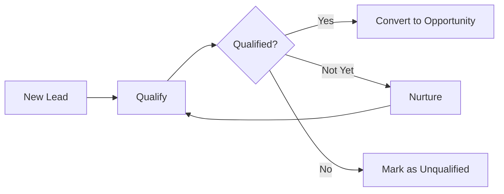
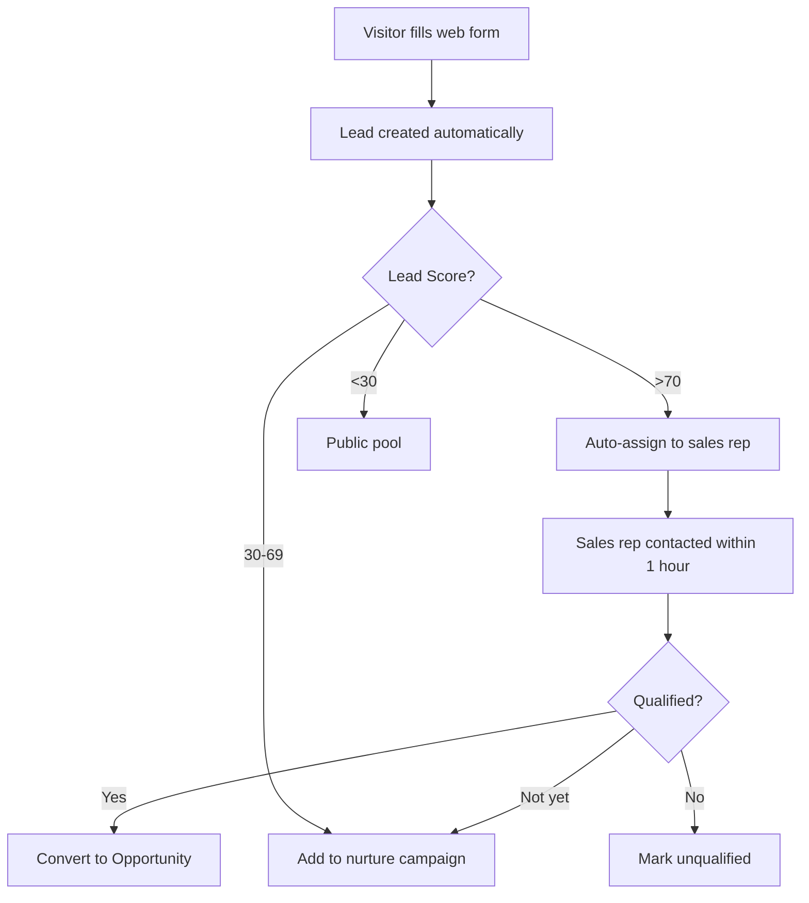

# Lead Management & Marketing Automation

Transform your marketing efforts into a predictable lead generation engine. HotCRM helps you capture leads from multiple channels, qualify them with AI-powered scoring, and deliver sales-ready opportunities to your team.

## What You Can Do

<Cards>
  <Card title="Capture Leads" icon="users">
    Multi-channel lead capture from web, social, events, and campaigns
  </Card>
  <Card title="Score & Qualify" icon="star">
    AI-powered lead scoring based on engagement and demographic fit
  </Card>
  <Card title="Run Campaigns" icon="megaphone">
    Track marketing campaign performance and ROI
  </Card>
  <Card title="Convert to Sales" icon="arrow-right">
    Seamlessly convert qualified leads to opportunities
  </Card>
</Cards>

---

## Lead Management

### The Lead Lifecycle

Every prospect in HotCRM follows a clear path from initial contact to sales-ready opportunity:



**Lead Statuses:**
1. **New** - Just captured, awaiting first contact
2. **Working** - Sales rep actively engaging
3. **Nurturing** - Not ready to buy, staying in touch
4. **Converted** - Qualified and converted to opportunity
5. **Unqualified** - Doesn't fit target profile or no longer interested

---

### Multi-Channel Lead Capture

Capture leads from everywhere your prospects are:

#### 📱 Web Forms
Create branded lead capture forms for your website:
- Contact us forms
- Demo request forms
- Content download forms
- Event registration forms
- Newsletter signups

**Example Use Case**: A visitor downloads your whitepaper "10 Ways to Improve Sales Productivity" → Lead is automatically created with source "Website" → AI scores based on company profile → High-score leads auto-assigned to sales reps.

#### 🌐 Landing Pages
Build conversion-optimized landing pages:
- Product launch pages
- Webinar registration
- Special offer pages
- Industry-specific solutions

**Built-in Features:**
- Drag-and-drop page builder
- Mobile-responsive designs
- A/B testing capability
- Conversion tracking

#### 📧 Email Campaigns
Capture responses from email marketing:
- Email opens and clicks tracked
- Link engagement recorded
- Automatic lead creation from responses
- Unsubscribe management

#### 🎯 Social Media
Integrate with social platforms:
- LinkedIn lead gen forms
- Facebook lead ads
- Twitter engagement
- WeChat mini-programs

#### 🎪 Events & Trade Shows
Capture leads at in-person events:
- QR code scanning
- Badge scanning integration
- Manual entry forms
- Bulk import from event apps

#### 🤝 Referrals & Partners
Track referral sources:
- Customer referrals
- Partner-sourced leads
- Employee referrals
- Affiliate programs

---

### Lead Scoring & Qualification

HotCRM automatically calculates a lead score (0-100) to help you prioritize your efforts.

#### How Lead Scoring Works

**1. Demographic Fit (40 points)**
- Industry match: 15 points
- Company size match: 15 points
- Job title/seniority: 10 points

**2. Data Completeness (30 points)**
- Contact information complete: 10 points
- Company information complete: 10 points
- Custom fields populated: 10 points

**3. Engagement (30 points)**
- Email opens: 5 points
- Email clicks: 10 points
- Website visits: 10 points
- Form submissions: 5 points

#### Lead Scoring in Action

**Example 1: Hot Lead (Score: 85)**
```
Sarah Chen, VP of Sales at TechCorp
- Industry: Technology ✅ (15 pts)
- Company: 500 employees ✅ (15 pts)
- Title: VP level ✅ (10 pts)
- All contact info complete ✅ (20 pts)
- Opened 3 emails ✅ (5 pts)
- Clicked 2 links ✅ (10 pts)
- Visited pricing page ✅ (10 pts)
Total: 85 points → Immediately assign to sales rep
```

**Example 2: Nurture Lead (Score: 45)**
```
John Doe, Junior Developer at StartupXYZ
- Industry: Technology ✅ (15 pts)
- Company: 10 employees ❌ (0 pts)
- Title: Junior level ❌ (0 pts)
- Only email provided ⚠️ (10 pts)
- Opened 1 email ✅ (5 pts)
- No clicks ❌ (0 pts)
- No website visits ❌ (0 pts)
Total: 30 points → Add to nurture campaign
```

#### AI-Enhanced Scoring

Beyond the basic formula, HotCRM's AI analyzes:
- Behavioral patterns (time on site, page views)
- Email signature analysis (job title, company info extraction)
- Similar customer profiles (lookalike modeling)
- Market signals (company funding, growth, hiring)

---

### Public Lead Pool (Lead Distribution)

The public lead pool ensures fair lead distribution and prevents leads from falling through the cracks.

#### How It Works

1. **Inbound leads** without an owner go to the public pool
2. **Sales reps** can view and claim leads from the pool
3. **Auto-assignment rules** distribute high-score leads automatically
4. **Returned leads** go back to the pool if not engaged within X days

#### Views and Filters

**Pre-built views:**
- 🔥 Hot Leads (Score > 70)
- 📅 Today's Leads
- 🌍 By Geographic Region
- 🏢 By Industry
- 💼 By Company Size

**Custom filters:**
```typescript
// Show me hot leads in technology sector
Filters: 
  Lead Score > 70
  Industry = "Technology"
  Status = "New"
```

#### Best Practices

✅ **Do:**
- Check the pool daily for new leads
- Claim leads you can actually follow up on
- Update lead status after first contact
- Return unresponsive leads to the pool

❌ **Don't:**
- Hoard leads without engaging them
- Let leads sit for more than 24 hours
- Claim leads outside your territory/specialty
- Mark leads as unqualified without attempting contact

---

### Lead Conversion

When a lead is qualified, convert them to create full customer records.

#### What Gets Created

**1 Lead Converts To:**
- ✅ **Account** (Company record)
- ✅ **Contact** (Individual person)
- ✅ **Opportunity** (Potential deal)

#### Conversion Process

**Step 1: Verify Information**
- Confirm company name and details
- Verify contact information
- Check for duplicate accounts/contacts

**Step 2: Convert**
```typescript
Convert Lead: Sarah Chen
↓
Creates:
├── Account: TechCorp Inc.
│   ├── Industry: Technology
│   ├── Employees: 500
│   └── Owner: John Smith
├── Contact: Sarah Chen
│   ├── Title: VP of Sales
│   ├── Email: sarah@techcorp.com
│   └── Account: TechCorp Inc.
└── Opportunity: TechCorp - Q1 Deal
    ├── Stage: Prospecting
    ├── Amount: $50,000 (estimated)
    └── Owner: John Smith
```

**Step 3: Lead Status Updated**
- Status → "Converted"
- Conversion date recorded
- Links to Account, Contact, Opportunity maintained
- Original lead record preserved for history

#### Conversion Rules

**When to Convert:**
- ✅ Lead has been qualified (phone call, meeting scheduled)
- ✅ Budget confirmed or estimated
- ✅ Timeline established
- ✅ Decision maker identified

**When NOT to Convert:**
- ❌ First touch, no qualification yet
- ❌ No clear opportunity identified
- ❌ Person is a student, competitor, or recruiter
- ❌ Incomplete information

---

## Campaign Management

Track marketing campaigns and measure ROI across all channels.

### Campaign Types

**Email Marketing**
- Newsletter campaigns
- Product announcements
- Nurture sequences
- Re-engagement campaigns

**Social Media**
- LinkedIn sponsored content
- Facebook/Instagram ads
- Twitter engagement
- WeChat campaigns

**Events**
- Trade shows and conferences
- Webinars and virtual events
- Customer appreciation events
- Product launches

**Content Marketing**
- Blog posts and articles
- Whitepapers and ebooks
- Case studies
- Video content

**Advertising**
- Google Ads
- Display advertising
- Retargeting campaigns
- Industry publications

---

### Campaign Metrics & ROI

Track the effectiveness of every marketing dollar:

#### Key Metrics

| Metric | Description | How to Improve |
|--------|-------------|----------------|
| **Leads Generated** | Total number of leads from campaign | Expand reach, improve targeting |
| **Cost Per Lead** | Campaign cost ÷ leads generated | Optimize targeting, reduce waste |
| **Conversion Rate** | Converted leads ÷ total leads × 100% | Better qualification, lead nurturing |
| **Revenue Generated** | Total revenue from converted leads | Focus on high-value prospects |
| **ROI** | (Revenue - Cost) ÷ Cost × 100% | Optimize all of the above |

#### Example Campaign Analysis

**Q1 2026 Email Campaign**
```
Budget: $5,000
Leads Generated: 250
Cost Per Lead: $20
Converted Leads: 50 (20% conversion)
Pipeline Created: $500,000
Closed Won: $150,000
ROI: (150,000 - 5,000) ÷ 5,000 = 2,900%
```

**Insights:**
- ✅ Excellent ROI - scale this campaign
- ✅ Good conversion rate (industry avg: 15%)
- 💡 Opportunity: $350K still in pipeline
- 🎯 Action: Focus on closing pipeline deals

---

### Campaign Member Tracking

Track individual engagement with each campaign:

**Member Statuses:**
- **Sent** - Campaign communication sent
- **Delivered** - Successfully delivered
- **Opened** - Email opened or landing page viewed
- **Clicked** - Clicked through to content
- **Responded** - Filled out form or replied
- **Attended** - Attended event or webinar
- **No Show** - Registered but didn't attend
- **Unsubscribed** - Opted out

**Use Cases:**
1. **Follow-up prioritization** - Focus on "Responded" and "Clicked" members
2. **Segmentation** - Create lists based on engagement level
3. **Multi-touch attribution** - Track which campaigns influenced deals
4. **A/B testing** - Compare engagement across campaign variations

---

## AI-Powered Marketing Features

### 1. AI Data Enrichment

Automatically extract and populate lead information from email signatures:

**Input: Email Signature**
```
John Smith
Senior Director of IT
Acme Corporation
john.smith@acme.com | +1-555-123-4567
www.acmecorp.com
```

**Output: Enriched Lead**
```typescript
{
  FirstName: "John",
  LastName: "Smith",
  Title: "Senior Director of IT",
  Company: "Acme Corporation",
  Email: "john.smith@acme.com",
  Phone: "+1-555-123-4567",
  Website: "www.acmecorp.com",
  Industry: "Technology" (AI-inferred),
  LeadScore: 75 (AI-calculated)
}
```

---

### 2. AI Marketing Copy Generation

Generate campaign content tailored to your audience:

**Example: Email Campaign**
```typescript
Input:
- Target: Enterprise IT Directors
- Product: Cloud CRM Solution
- Goal: Book demo meetings
- Tone: Professional

AI Output:
Subject: "Cut IT costs by 40% while improving sales efficiency"

Body:
Dear [First Name],

Managing sales technology across your enterprise shouldn't mean 
managing complexity. HotCRM delivers enterprise-grade CRM with:

• 40% lower TCO than Salesforce
• Modern API-first architecture
• Self-hosted or cloud deployment
• AI-powered sales intelligence

Join 500+ IT leaders who've made the switch.

[Book a 15-Minute Demo]

Best regards,
[Your Name]
```

---

### 3. Best Lead Recommendations

AI suggests which leads to contact next based on:
- Lead score and engagement
- Company fit and intent signals
- Response likelihood prediction
- Optimal contact timing

**Daily Recommended Leads:**
```
🔥 Sarah Chen (Score: 95)
   VP of Sales, TechCorp | Viewed pricing 3x yesterday
   Recommended action: Call today before 10 AM

⭐ Mike Johnson (Score: 88)
   CTO, StartupXYZ | Downloaded whitepaper, opened 5 emails
   Recommended action: Send personalized email

💼 Lisa Wong (Score: 82)
   Dir. of Operations, GlobalCo | Attended webinar
   Recommended action: Follow up on webinar Q&A
```

---

### 4. Audience Segmentation

AI analyzes your target market and suggests optimal segments:

**Example Analysis:**
```
Target: "Enterprise Software Buyers"

AI-Identified Segments:
1. Tech-Forward Leaders (35%)
   - Early adopters
   - Focus on innovation
   - Recommended channels: LinkedIn, Webinars

2. ROI-Driven Executives (40%)
   - Value-focused decision makers
   - Focus on cost savings
   - Recommended channels: Email, Case Studies

3. Risk-Averse Operators (25%)
   - Prefer proven solutions
   - Focus on security & reliability
   - Recommended channels: Whitepapers, References
```

---

## Best Practices

### For Marketing Teams

1. **Set Up Tracking**
   - Tag all campaign sources
   - Use UTM parameters consistently
   - Create dedicated landing pages

2. **Score Your Leads**
   - Define your ideal customer profile
   - Set scoring thresholds
   - Review and adjust quarterly

3. **Nurture Systematically**
   - Create nurture tracks by persona
   - Provide value, not just sales pitches
   - Re-engage cold leads periodically

4. **Measure What Matters**
   - Track full-funnel metrics
   - Calculate ROI for each campaign
   - Share results with sales team

### For Sales Teams

1. **Work the Pool Daily**
   - Check for new hot leads each morning
   - Claim and contact within 1 hour
   - Return leads you can't work

2. **Qualify Thoroughly**
   - Use BANT (Budget, Authority, Need, Timeline)
   - Document all interactions
   - Convert only qualified leads

3. **Provide Feedback**
   - Mark bad leads quickly
   - Tell marketing what's working
   - Help refine lead scoring

---

## Common Workflows

### Workflow 1: Inbound Web Lead



### Workflow 2: Event Lead Capture

```
1. Attendee visits booth → Scan badge
2. Lead created with source "Trade Show Q1"
3. Add to campaign "Trade Show Q1 2026"
4. Mark campaign member status "Attended"
5. Same day: Send thank you email
6. Day 3: Sales rep follows up
7. If interested: Convert to opportunity
8. If not ready: Add to quarterly newsletter
```

### Workflow 3: Campaign Performance Review

```
Weekly Review Checklist:
□ How many leads generated?
□ What's the average lead score?
□ How many converted to opportunities?
□ What's the cost per lead?
□ Which channels performed best?
□ What needs optimization?
□ Scale winners, cut losers
```

---

## Roadmap: Planned Features

### Q1 2026
- 🚧 **Lead Assignment Rules** - Advanced round-robin and territory-based assignment
- 🚧 **Lead Deduplication** - Automatic duplicate detection and merging
- 🚧 **Email Integration** - Gmail/Outlook plugin for 1-click lead capture

### Q2 2026
- 🚧 **Marketing Automation** - Multi-step nurture campaigns
- 🚧 **Progressive Profiling** - Gradual lead data enrichment
- 🚧 **Web Visitor Tracking** - Anonymous visitor tracking and identification

### Q3 2026
- 🚧 **Predictive Lead Scoring** - Machine learning-based scoring
- 🚧 **Account-Based Marketing** - Target account identification and tracking
- 🚧 **Social Listening** - Monitor social media for lead signals

---

## Success Stories

### Example: Tech Startup

**Before HotCRM:**
- Leads scattered across email, spreadsheets
- No lead scoring or prioritization
- 10% lead-to-opportunity conversion
- 30-day average response time

**After HotCRM:**
- All leads in one system with scores
- Auto-assignment of hot leads
- 25% lead-to-opportunity conversion
- 2-hour average response time

**Results:** 150% increase in qualified opportunities, 60% reduction in cost per acquisition

---

## Getting Started

<Cards>
  <Card title="Quick Start Guide" href="/docs/getting-started/quick-start">
    Create your first lead in 5 minutes
  </Card>
  <Card title="Campaign Setup" href="/docs/guides/campaign-setup">
    Launch your first marketing campaign
  </Card>
  <Card title="Lead Scoring Guide" href="/docs/guides/lead-scoring">
    Configure AI lead scoring for your business
  </Card>
  <Card title="API Integration" href="/docs/api-reference/rest-api">
    Integrate with your marketing tools
  </Card>
</Cards>

---

## Related Topics

- [Sales Automation](/docs/features/sales-automation) - Convert leads into closed deals
- [AI Capabilities](/docs/ai/overview) - Explore all AI features
- [Creating Custom Objects](/docs/development/creating-objects) - Extend lead management
