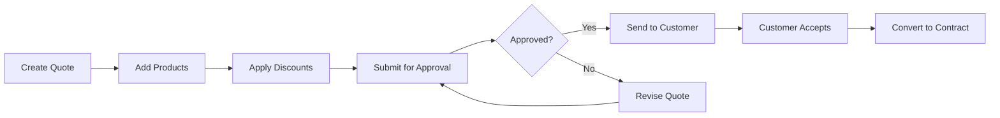

# Product & Quote Management (CPQ)

Configure, Price, Quote—the three critical steps to creating accurate, professional proposals. HotCRM's CPQ (Configure, Price, Quote) capabilities help you manage complex product catalogs, implement sophisticated pricing strategies, and generate quotes in minutes instead of hours.

## What You Can Do

<Cards>
  <Card title="Product Catalog" icon="package">
    Manage products, bundles, and SKUs with inventory tracking
  </Card>
  <Card title="Smart Pricing" icon="dollar-sign">
    Volume discounts, regional pricing, and promotional rules
  </Card>
  <Card title="Quote Generation" icon="file-text">
    Create professional quotes with line items and terms
  </Card>
  <Card title="Approval Workflows" icon="check-circle">
    Multi-level approvals for discounts and special terms
  </Card>
</Cards>

---

## Product Catalog

### What is a Product?

A Product represents anything you sell—software licenses, hardware devices, professional services, subscriptions, or support packages.

---

### Product Types

**Software & Digital Products**
- SaaS subscriptions
- Software licenses (perpetual or annual)
- Digital downloads
- API access tiers

**Hardware & Physical Goods**
- Servers and equipment
- Network devices
- Accessories
- Replacement parts

**Professional Services**
- Implementation services (fixed price or hourly)
- Consulting (daily or hourly)
- Training sessions
- Custom development

**Support & Maintenance**
- Standard support plans
- Premium support
- Extended warranties
- SLA packages

**Subscriptions**
- Monthly recurring revenue (MRR)
- Annual contracts
- Usage-based pricing
- Tiered subscriptions

---

### Key Product Information

| Field | Description | Example |
|-------|-------------|---------|
| **Product Name** | What you're selling | "HotCRM Enterprise License" |
| **Product Code/SKU** | Unique identifier | "HCRM-ENT-2026" |
| **Product Family** | Category/grouping | Software, Hardware, Services |
| **Description** | What it is and why buy it | "Full-featured CRM for teams 50+" |
| **List Price** | Standard retail price | $99/user/month |
| **Cost Price** | Your cost (COGS) | $25/user/month |
| **Unit of Measure** | How it's sold | License, Hour, Device, Seat |
| **Active Status** | Currently available? | Yes/No |

---

### Product Families & Organization

Organize products into logical groups:

**By Solution:**
```
CRM Suite
├── Sales Cloud
├── Marketing Cloud
└── Service Cloud

Professional Services
├── Implementation
├── Training
└── Consulting
```

**By Market:**
```
Enterprise Solutions
SMB Solutions
Startup Solutions
```

**By Pricing Model:**
```
One-Time Purchase
Monthly Subscription
Annual Subscription
Usage-Based
```

---

### Product Bundles

**What is a Bundle?**
A bundle is a package of multiple products sold together, often at a discounted price.

**Common Bundle Types:**

**Solution Bundles:**
```
"Complete CRM Suite" Bundle
├── Sales Module: $99/user/month
├── Marketing Module: $49/user/month
├── Service Module: $49/user/month
└── Bundle Price: $179/user/month (save $18)
```

**Implementation Packages:**
```
"Quick Start Package" Bundle
├── Software License (Annual): $12,000
├── Implementation Services: $8,000
├── Training (2 days): $3,000
└── Bundle Price: $20,000 (save $3,000)
```

**Support Tiers:**
```
"Platinum Support" Bundle
├── 24/7 Phone Support
├── 1-hour SLA
├── Dedicated Support Engineer
├── Quarterly Business Reviews
└── Price: $500/month
```

---

### Inventory Management

Track stock levels for physical products:

**Stock Statuses:**
- ✅ **In Stock** - Available for immediate shipment
- ⚠️ **Low Stock** - Below reorder threshold
- ❌ **Out of Stock** - Not available, backorder
- 🔄 **Reordering** - Purchase order placed with supplier

**Inventory Alerts:**
```
Product: Network Switch Pro
Current Stock: 5 units
Reorder Level: 10 units
Status: Low Stock ⚠️

Action: Create purchase order for 50 units
```

**Best Practices:**
- Set reorder levels based on lead time
- Track stock across multiple warehouses
- Auto-alert when stock is low
- Prevent overselling with real-time checks

---

## Pricing & Discounts

### Price Books

**What is a Price Book?**
A price book is a collection of products with their prices for a specific market, region, or customer segment.

**Common Price Books:**

**Standard Price Book** (Default)
- List prices for all products
- Used when no other price book applies
- Base reference for discounts

**Regional Price Books**
```
US Price Book
- Product A: $100 USD

EMEA Price Book
- Product A: €95 EUR

APAC Price Book
- Product A: $120 SGD
```

**Customer Segment Price Books**
```
Enterprise Price Book
- Product A: $85 (15% discount)

SMB Price Book
- Product A: $95 (5% discount)

Startup Price Book
- Product A: $50 (50% discount)
```

**Partner Price Books**
```
Gold Partner
- Product A: $60 (40% margin)

Silver Partner
- Product A: $70 (30% margin)
```

---

### Discount Strategies

**Volume Discounts** (Quantity-based)
```
1-10 licenses: $100 each
11-50 licenses: $90 each (10% off)
51-100 licenses: $80 each (20% off)
100+ licenses: $70 each (30% off)
```

**Promotional Discounts** (Time-limited)
```
"Q1 Special"
- 20% off all products
- Valid: Jan 1 - Mar 31, 2026
- Discount code: Q12026
```

**Loyalty Discounts** (Customer-based)
```
Existing customers: 10% off upgrades
Renewals: 5% off if renewed 30 days early
Multi-year: 15% off 3-year contracts
```

**Strategic Discounts** (Deal-specific)
```
Competitive displacement: Up to 30%
Large deal (>$100K): Up to 25%
Reference customer: 15% off
```

---

### Pricing Rules

Automate complex pricing logic:

**Rule 1: Minimum Quantity**
```
IF Quantity < MinimumOrderQuantity
THEN Show Error: "Minimum order is X units"
```

**Rule 2: Volume Discount**
```
IF Quantity >= 50
THEN Apply 20% discount
ELSE IF Quantity >= 20
THEN Apply 10% discount
```

**Rule 3: Bundle Discount**
```
IF Cart contains (Product A + Product B)
THEN Apply 15% discount on Product B
```

**Rule 4: Regional Pricing**
```
IF Customer Region = "APAC"
THEN Use APAC Price Book
```

---

## Quote Generation

### What is a Quote?

A Quote is a formal proposal presenting products, pricing, and terms to a customer. It's a legally binding offer if accepted.

---

### Quote Workflow



---

### Creating a Quote

**Step 1: Quote Header**
```
Quote To: TechCorp Inc.
Opportunity: TechCorp - CRM Implementation
Valid Until: March 31, 2026
Payment Terms: Net 30
Billing Frequency: Annual
```

**Step 2: Add Products (Line Items)**
```
Line 1: HotCRM Enterprise License
  Quantity: 50 users
  List Price: $99/user/month
  Discount: 15% (volume discount)
  Unit Price: $84.15/user/month
  Annual Total: $50,490

Line 2: Implementation Services
  Quantity: 80 hours
  List Price: $200/hour
  Discount: 10% (package discount)
  Unit Price: $180/hour
  Total: $14,400

Line 3: Training (2 days)
  Quantity: 2 days
  List Price: $2,000/day
  Discount: 0%
  Unit Price: $2,000/day
  Total: $4,000
```

**Step 3: Calculate Totals**
```
Subtotal: $68,890
Tax (if applicable): $0
Total: $68,890

First Year: $68,890
Annual Recurring: $50,490
```

**Step 4: Add Terms & Conditions**
- Payment terms
- Cancellation policy
- SLA commitments
- Implementation timeline
- Acceptance criteria

---

### Quote Templates

**Pre-formatted professional templates:**

**Enterprise Software Quote**
- Executive summary
- Solution overview
- Pricing table
- ROI calculator
- Implementation plan
- Terms and conditions
- Signature block

**Professional Services Quote**
- Scope of work
- Deliverables
- Timeline
- Resource allocation
- Pricing (fixed or T&M)
- Payment schedule

**Product Sale Quote**
- Product specifications
- Quantity pricing
- Shipping terms
- Warranty information
- Return policy

---

### Quote Versions

Track quote revisions:

```
Quote #Q-2026-0123

Version 1.0 (Feb 1)
- Initial quote: $75,000

Version 1.1 (Feb 5)
- Added training: $80,000
- Status: Sent to customer

Version 2.0 (Feb 10)
- Removed premium support: $75,000
- Increased discount to 20%: $70,000
- Status: Approved, sent to customer

Version 2.1 (Feb 12)
- Final negotiated price: $68,890
- Status: Accepted by customer ✅
```

---

### Quote Status Lifecycle

**1. Draft** - Being created, not visible to customer

**2. In Review** - Internal review before sending

**3. Pending Approval** - Requires manager/director approval

**4. Approved** - Approved, ready to send

**5. Presented** - Sent to customer, awaiting response

**6. Accepted** - Customer accepted, convert to contract

**7. Rejected** - Customer declined

**8. Expired** - Validity period ended

---

## Discount Approvals

### Why Approvals Matter

Prevent margin erosion while empowering sales teams:
- Maintain pricing integrity
- Ensure profitability
- Control escalation path
- Audit discount decisions

---

### Approval Levels

**Level 1: Auto-Approved (No approval needed)**
```
Standard discounts up to 10%
Volume discounts per price book
Pre-approved promotional discounts
```

**Level 2: Sales Manager**
```
Discounts 11-20%
Payment term extensions (Net 30 → Net 45)
Custom bundles
```

**Level 3: Director**
```
Discounts 21-30%
Non-standard pricing
Multi-year deals
Large deal ($100K+)
```

**Level 4: VP/C-Level**
```
Discounts >30%
Strategic accounts
Custom contracts
Pilot programs
```

---

### Approval Workflow

**Example: 25% Discount Request**

```
Step 1: Rep creates quote with 25% discount
  Status: Pending Approval

Step 2: Auto-routed to Sales Director
  Email: "Quote Q-2026-0123 requires your approval"
  - Customer: TechCorp Inc.
  - Deal Size: $75,000
  - Requested Discount: 25%
  - Reason: "Competitive displacement"
  - Approval Deadline: 24 hours

Step 3: Director reviews
  Options:
  [Approve] [Reject] [Request More Info]

Step 4a: If Approved
  Status: Approved
  → Rep can send quote to customer

Step 4b: If Rejected
  Status: Rejected
  → Rep must revise quote
  → Comment: "Maximum 20% for this deal size"
```

---

### Approval Best Practices

✅ **Provide Context**
- Why is discount needed?
- What's the competitive situation?
- What's the strategic value?
- Is this a precedent?

✅ **Set Clear Policies**
- Document approval thresholds
- Define standard discounts
- Establish approval SLAs
- Train team on policies

✅ **Track Metrics**
- Average discount percentage
- Approval cycle time
- Approval vs. rejection rate
- Discount impact on margin

---

## Quote-to-Cash Process

### End-to-End Flow

```
1. Opportunity qualified
   → Create quote

2. Configure products
   → Add line items
   → Apply discounts

3. Submit for approval (if needed)
   → Manager approves

4. Send quote to customer
   → Customer reviews

5. Customer accepts
   → Convert to contract
   → Create invoice
   → Collect payment

6. Recognize revenue
   → Deliver product/service
   → Customer onboarding
```

---

## AI-Powered CPQ Features

### 1. Smart Product Recommendations

AI suggests products based on:
- Customer industry and size
- Similar customer purchases
- Opportunity stage and value
- Historical buying patterns

**Example:**
```
Opportunity: TechCorp - CRM Implementation

AI Recommendations:
✨ Customers like TechCorp also bought:
1. Implementation Services (95% probability)
2. Premium Support (80% probability)
3. Training Package (75% probability)
4. API Integration (60% probability)

Estimated quote value: $85,000
```

---

### 2. Competitive Pricing Intelligence

AI analyzes market rates:
- Competitor pricing (if available)
- Industry benchmarks
- Historical win/loss by price
- Optimal price point for this deal

**Example:**
```
Recommended Price: $70-75K
- Probability of winning at $75K: 80%
- Probability of winning at $70K: 95%
- Your usual discount: 15%
- Competitor estimate: $72K
```

---

### 3. Quote Optimization

AI suggests improvements:
- Bundle products for better value
- Remove low-value items
- Adjust quantities for volume discounts
- Alternative configurations

---

### 4. Automated Discounting

AI determines optimal discount:
- Deal size and strategic value
- Customer's price sensitivity
- Competitive pressure
- Margin constraints

---

## Best Practices

### For Sales Reps

✅ **Configure Accurately**
- Understand customer requirements fully
- Don't over-spec or under-spec
- Verify quantities carefully
- Include everything customer needs

✅ **Price Competitively**
- Research market rates
- Consider total value, not just price
- Justify premium pricing with ROI
- Bundle for better perceived value

✅ **Get Approvals Fast**
- Request approvals early
- Provide clear justification
- Have backup options ready
- Don't promise what you can't deliver

✅ **Present Professionally**
- Use branded templates
- Include clear terms
- Proofread everything
- Highlight value, not just price

---

### For Sales Managers

✅ **Set Clear Policies**
- Define approval thresholds
- Document standard discounts
- Establish pricing guidelines
- Communicate policies clearly

✅ **Review Thoughtfully**
- Consider strategic value
- Review competitive situation
- Check margin impact
- Approve/reject quickly (SLA: 4 hours)

✅ **Track Performance**
- Monitor discount levels
- Review win/loss by pricing
- Analyze quote-to-close rates
- Optimize pricing over time

---

## Common Workflows

### Workflow 1: Standard Quote

```
1. Opportunity reaches Proposal stage
2. Rep clicks "Create Quote"
3. System pre-fills customer info
4. Rep adds products from catalog
5. System calculates totals automatically
6. Standard 10% discount applied (auto-approved)
7. Rep reviews and sends to customer
8. Customer accepts via email
9. Quote converts to contract
10. Invoice generated
```

---

### Workflow 2: Custom Quote with Approval

```
1. Rep configures custom solution
2. Applies 25% discount (requires approval)
3. Adds business justification
4. Submits for Director approval
5. Director receives email notification
6. Director reviews in CRM:
   - Deal size: $100K
   - Customer: Strategic account
   - Competitor: Salesforce
   - Justification: Strong
7. Director approves
8. Rep sends quote to customer
9. Customer negotiates on payment terms
10. Rep creates v2.0 with Net 60 terms
11. Resubmits for approval (payment terms changed)
12. Director approves
13. Quote sent and accepted
14. Contract created
```

---

## Roadmap: Planned Features

### Q1 2026
- 🚧 **Guided Selling** - Interactive product selection wizard
- 🚧 **Dynamic Pricing** - Real-time pricing based on inventory and demand
- 🚧 **Quote Analytics** - Win/loss analysis by pricing and discounts

### Q2 2026
- 🚧 **E-Signature Integration** - DocuSign/Adobe Sign integration
- 🚧 **Subscription Management** - Recurring revenue and renewals
- 🚧 **Usage-Based Pricing** - Metered billing and consumption pricing

### Q3 2026
- 🚧 **Partner Portal** - Self-service quoting for partners
- 🚧 **Configure-Price-Quote AI** - Fully automated quote generation
- 🚧 **Revenue Recognition** - ASC 606 compliant revenue management

---

## Success Metrics

**Impact of CPQ:**
- ⬆️ 50% faster quote generation (hours → minutes)
- ⬆️ 35% larger average deal size (better bundling)
- ⬆️ 95% quote accuracy (fewer errors)
- ⬆️ 25% improvement in win rates (competitive pricing)
- ⬇️ 60% reduction in approval cycle time
- ⬆️ 20% better margins (controlled discounting)

---

## Getting Started

<Cards>
  <Card title="Product Catalog Setup" href="/docs/guides/product-catalog">
    Create your first products and bundles
  </Card>
  <Card title="Pricing Rules" href="/docs/guides/pricing-rules">
    Configure volume discounts and price books
  </Card>
  <Card title="Quote Templates" href="/docs/guides/quote-templates">
    Design professional quote templates
  </Card>
  <Card title="Approval Workflows" href="/docs/guides/approval-workflows">
    Set up discount approval rules
  </Card>
</Cards>

---

## Related Topics

- [Sales Automation](/docs/features/sales-automation) - Create quotes from opportunities
- [Contract Management](/docs/features/contracts-payments) - Convert quotes to contracts
- [AI Capabilities](/docs/ai/overview) - AI-powered product recommendations
- [API Reference](/docs/api-reference/rest-api) - CPQ API integration
