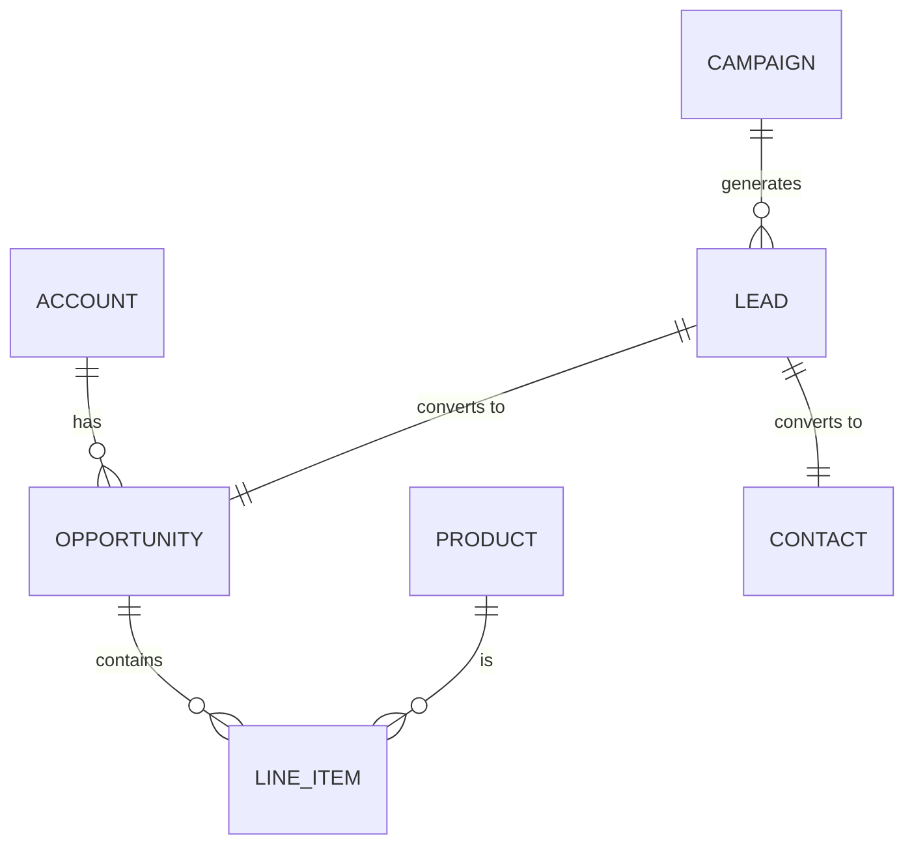

# Sales Cloud Subsystem

The **Sales Cloud** module manages the end-to-end sales lifecycle from unidentified prospect to closed revenue. It is the engine of growth for the enterprise.

## 1. Domain Model (Schema)

The subsystem is built around the "Opportunity" as the central transaction.

### 1.1 Core Objects (`packages/crm`)

| Object Name | API Name | Description | Key Fields |
|-------------|----------|-------------|------------|
| **Lead** | `lead` | Unqualified potential customer. | `status`, `source`, `rating`, `company` |
| **Opportunity** | `opportunity` | A qualified deal in progress. | `stage`, `amount`, `close_date`, `probability` |
| **Opportunity Line Item** | `opportunity_line_item` | Products attached to a deal. | `product_id`, `quantity`, `unit_price`, `total_price` |
| **Banned Competitor** | `competitor` | Competitive intelligence tracking. | `strengths`, `weaknesses`, `battlecard_url` |
| **Forecast** | `forecast_quota` | Sales targets and predictions. | `user_id`, `period`, `quota_amount`, `commit_amount` |

### 1.2 Relationship Diagram

## 2. Business Logic (Automation)

The Business Logic layer enforces the sales process and ensures data integrity.

### 2.1 Lead Conversion Process (`lead.convert.action.ts`)
When a Lead is "Qualified":
1.  **Create Account**: If company doesn't exist.
2.  **Create Contact**: Link to Account.
3.  **Create Opportunity**: Initial stage "Prospecting".
4.  **Archive Lead**: Mark status "Converted".

### 2.2 Opportunity Stage Automations (`opportunity.workflow.ts`)
- **Stage: Negotiation**:
    - **Trigger**: `before_update`
    - **Logic**: Require `approved_quote_id` not null if Amount > $100k.
- **Stage: Closed Won**:
    - **Trigger**: `after_update`
    - **Logic**: Auto-generate `Contract` and `Order` records in Revenue Cloud.

### 2.3 Deal Health Scoring (AI) (`opportunity.score.action.ts`)
- **Trigger**: Nightly Schedule or On-Demand.
- **Inputs**: `activities_count`, `last_contacted_date`, `email_sentiment`.
- **Output**: Update `health_score` (0-100) and `risk_factors` (JSON).

## 3. User Experience (UI)

### 3.1 Sales Rep Cockpit (`sales_home.dashboard.ts`)
- **Key Metrics**: "My Pipeline", "Gap to Quota", "Tasks Due Today".
- **Visuals**: Funnel Chart of Opps by Stage.

### 3.2 Pipeline Manager (`opportunity.view.ts`)
- **Type**: `kanban`
- **Group By**: `stage_name`
- **Aggregate**: `sum(amount)`
- **Card Fields**: `name`, `account_name`, `close_date`, `health_score`.

### 3.3 Deal Room (`opportunity.page.ts`)
A comprehensive "Record Page" layout:
- **Header**: Key info (Amount, Close Date, Stage Path).
- **Main Tab**: Details & Activity Timeline.
- **Related Tab**: Products, Quotes, Contacts, Competitors.
- **AI Sidebar**: "Copilot: Suggest Next Step", "Generate Summary".

## 4. Security & Access

- **Roles**:
    - `sales_rep`: View Own deals.
    - `sales_manager`: View Team deals, Edit Quotas.
    - `vp_sales`: View All, Approve Discounts > 20%.
- **Sharing Rules**:
    - "Deals involving 'Strategic Account' are shared with Pre-Sales Engineering Group."
