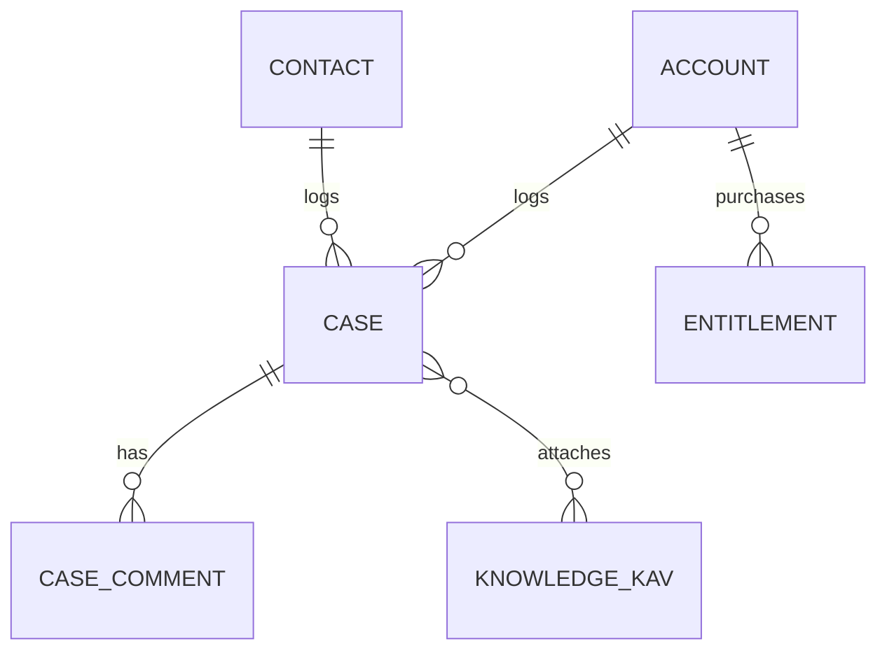

# Service Cloud Subsystem

The **Service Cloud** delivers high-velocity support capabilities, moving from reactive ticket handling to proactive customer success using Knowledge and AI.

## 1. Domain Model (Schema)

### 1.1 Core Objects (`packages/support`)

| Object Name | API Name | Description | Key Fields |
|-------------|----------|-------------|------------|
| **Case** | `case` | A customer issue or request. | `subject`, `priority`, `status`, `origin` |
| **Case Comment** | `case_comment` | Thread of communication. | `body`, `is_public` |
| **Knowledge Article** | `knowledge_kav` | Help content. | `title`, `body_html`, `category`, `status` |
| **SLA Policy** | `entitlement` | Support agreement. | `account_id`, `start_date`, `sla_minutes` |

### 1.2 Relationship Diagram

## 2. Business Logic (Automation)

### 2.1 Omni-Channel Routing (`case.route.action.ts`)
- **Trigger**: `after_create`
- **Logic**:
    1.  Check `Case.origin` (Email, Phone, Web).
    2.  Check `Case.priority`.
    3.  Find available Agent in `support_queue`.
    4.  Assign `owner_id` based on "Least Active" or "Skill Match".

### 2.2 SLA Countdown (`case.sla.hook.ts`)
- **Trigger**: `on_create`, `on_update`.
- **Logic**:
    - If `priority` == 'Critical', set `target_resolution_time` = Now + 2 hours.
    - If `status` != 'Closed' AND `Now > target_resolution_time`, Trigger Escalation alert to Manager.

### 2.3 Knowledge Deflection (AI) (`knowledge.search.action.ts`)
- **Action**: When User is typing case Subject on Portal.
- **Logic**: Vector Search (`embedding(subject)`) against Knowledge Base.
- **Output**: Return Top 3 Articles. If user clicks "Solved", abort Case creation.

## 3. User Experience (UI)

### 3.1 Agent Console (`service_console.app.ts`)
A "Split View" application designed for high-density work.
- **Left Panel**: List of "My Open Cases".
- **Center Panel**: Current Case Workspace (Details, Chatter).
- **Right Panel**: Knowledge Sidebar & AI Agent (Suggested Replies).

### 3.2 Knowledge Editor (`knowledge.page.ts`)
- **Layout**: Rich Text Editor for Content, Sidebar for Version/Language control.

## 4. Security & Access

- **Public**: Can read `is_public=true` Knowledge Articles.
- **Customer**: Can Create/Read *own* Cases.
- **Support Agent**: Can Read/Edit All Cases in assigned Queue.
