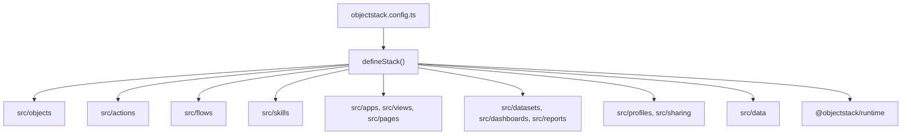

# HotCRM Architecture

> Current architecture for the single-app HotCRM repository.

## Overview

HotCRM is an ObjectStack marketplace app. It is not currently organized as multiple scoped npm packages; the app is assembled from the local `src/` tree and registered through [`objectstack.config.ts`](../objectstack.config.ts).



The diagram sketches the assembly path and draws only the largest metadata areas; it is
deliberately not a roster. [Metadata Areas](#metadata-areas) below is the complete
directory-to-key map.

The compiled marketplace artifact is produced by `pnpm build`. The generated artifact is the package that gets published, not the TypeScript source layout itself.

## Stack Manifest

The stack manifest defines:

| Field | Current value |
| --- | --- |
| id | `app.objectstack.hotcrm` |
| namespace | `crm` |
| version | `3.0.0` |
| type | `app` |
| name | `HotCRM` |

`engines.protocol` is deliberately **not** transcribed into that table. The
protocol major this app's metadata is authored against is declared in
[`objectstack.config.ts`](../objectstack.config.ts) (`manifest.engines.protocol`)
and restated by `objectstack.manifest.json` (`engines.protocol` and `specVersion`)
and by the `@objectstack/spec` range `package.json` installs.
`test/docs-declared-versions.test.ts` pins those three files to each other, so the
fact is already gated where it lives — a copy here would be the one copy nothing
compares against.
*Supersedes the transcribed `^17.0.0-rc.1` row that stood here while all three
sources declared `^17.2.0` — 2026-08-31 ruling, item 5.*

The runtime capabilities this app needs are declared in `requires` in
[`objectstack.config.ts`](../objectstack.config.ts), and that roster is deliberately
**not** transcribed here — it is not a fact this page can keep true, and a copy here
would be the one copy nothing compares against.

What the roster cannot tell a reader is why two capabilities are where they are. Those
two decisions are the architecture, so this section states them instead:

- **`ai` is deliberately absent.** ObjectStack 11.3.0 (ADR-0025 S2) moved the AI runtime
  out of the open edition, and under ObjectStack 16 `requires: ['ai']` is *fail-fast* —
  declaring it would hard-abort `objectstack start`/`dev` for this open-edition app. The
  AI metadata is unaffected: the skills still validate, build into the artifact, and run
  wherever a runtime provides the `ai` tier.
- **`hierarchy-security` is deliberately present** — the one enterprise-edition
  capability this app declares. `sales_manager` authors `writeScope: 'own_and_reports'`
  on `crm_contract`, an ADR-0057 hierarchy scope resolved by a service that ships only in
  `@objectstack/security-enterprise`, and `defineStack` refuses that grant outright
  without the capability, so the scope and the declaration move together or not at all.
  Unlike `ai` it is **safe** on an open-edition boot and does not fail fast: nothing
  aborts, the resolver is simply absent, and the scope fails *closed* to owner-only — a
  Sales Manager still cannot edit a rep's contract there.

The config comments carry the full rationale for both.
*Supersedes the seven-name roster transcribed here, which named seven of the eight
capabilities declared and closed with "and". The member it dropped was
`hierarchy-security` — half of the very contrast the paragraph beneath it was drawing —
2026-08-31 ruling, item 5.*

## Metadata Areas

Every `src/` directory the stack registers has a row below, and the right-hand column
names the `defineStack` key it registers as. Where the `requires` roster above points at
its source, this table is *meant* to be exhaustive — a directory-to-key map is worth nothing if a reader has to
wonder what is missing from it — so it carries the rule that makes it checkable:
**every directory under `src/` is either a row here or one of the two named beneath the
table.** Adding a `src/` area is not finished until it is one or the other.

| Area | Files | Registered as |
| --- | --- | --- |
| Data model | `src/objects/*.object.ts` | `objects` |
| Lifecycle hooks | `src/objects/*.hook.ts` via `src/hooks/index.ts` | `hooks` |
| UI actions | `src/actions/*.actions.ts` | `actions` |
| Automation | `src/flows/*.flow.ts` | `flows` |
| AI skills | `src/skills/*.skill.ts` | `skills` |
| Apps, views, pages | `src/apps/`, `src/views/`, `src/pages/` | `apps`, `views`, `pages` |
| Analytics | `src/datasets/`, `src/dashboards/`, `src/reports/` | `datasets`, `dashboards`, `reports` |
| Import mappings | `src/mappings/*.mapping.ts` | `mappings` |
| Security | `src/profiles/`, `src/sharing/` | `permissions`, `sharingRules`, `positions` |
| i18n | `src/translations/` | `translations`, `i18n` |
| Demo data | `src/data/` | `data` |

Import mappings are reusable projections referenced by name from the import endpoint
(`mappingName: 'crm_account_import'`), so a customer's own spreadsheet loads without
mapping every column by hand; the matching templates live in `assets/import-templates/`.

Two directories under `src/` are deliberately not rows, because neither registers
anything:

- `src/docs/` — the `crm_*.md` package documentation pages. They are prose about the app,
  not metadata the stack loads; `test/docs-drift.test.ts` pins their business-rule claims
  to the same compiled conditions the objects declare.
- `src/interfaces/` — a barrel that currently exports nothing at all; its `index.ts` is
  the licence header and no more.

*Supersedes the table that omitted `mappings` while presenting itself as the map of the
tree. Appending that one row was declined as the whole fix: nothing on the page said what
the table was a complete list **of**, so the next registration key would have gone
missing the same way — 2026-08-31 ruling, item 5.*

## Data Model

Objects are declared with `ObjectSchema.create()` and use the explicit `crm_` namespace prefix.

```typescript
import { ObjectSchema, Field } from '@objectstack/spec/data';

export const Account = ObjectSchema.create({
  name: 'crm_account',
  label: 'Account',
  fields: {
    name: Field.text({ label: 'Account Name', required: true }),
    owner: Field.lookup('user', { label: 'Account Owner' }),
  },
});
```

The object roster is deliberately **not** restated here — `src/objects/*.object.ts` is
its source of truth, one file per object, each registering its `crm_`-prefixed `name`.
The model spans four business domains: Sales, Service, Marketing, and Revenue.
*Supersedes the hand-maintained fifteen-name domain table that stood here, which had
already drifted three objects behind the tree — 2026-08-31 ruling, item 5.*

## Hooks

Object lifecycle hooks live beside object definitions in `src/objects/*.hook.ts`. They are collected in `src/hooks/index.ts` and passed to `defineStack({ hooks: allHooks })`.

Use hooks for record-level invariants and cross-object maintenance that must run with data changes, such as:

- lead defaults and conversion bookkeeping
- opportunity probability and approval fields
- quote and line-item total calculations
- case SLA and escalation fields
- account and contact relationship maintenance

## Actions

Actions live in `src/actions/*.actions.ts`. They define record-header, list-item, list-toolbar, modal, and flow-triggering behaviors. Some action bodies are executable metadata and can use constrained capabilities such as `api.write`.

Example shape:

```typescript
export const ConvertLeadAction = {
  name: 'convert_lead',
  label: 'Convert Lead',
  objectName: 'crm_lead',
  type: 'flow',
  target: 'lead_conversion',
  locations: ['record_header', 'list_item'],
};
```

## Flows

Flows live in `src/flows/*.flow.ts` and are registered through `allFlows`. HotCRM uses record-change, scheduled, and screen-style automation for lead conversion, routing, alerts, SLA monitoring, contract renewal, quote expiration, campaign enrollment, and approval paths.

Record-change flows rely on the `triggers` capability declared in the stack manifest.

## UI

HotCRM ships metadata for:

- one primary app surface
- list, kanban, and object-specific views
- record detail pages and utility pages
- dashboards and reports

The UI is metadata-driven. Object field definitions, views, pages, actions, permissions, translations, and sharing rules all influence the rendered experience.

## AI

AI is modeled as ObjectStack metadata. The surface is **skills-only**: the two
`*.agent.ts` copilots were retired in [#512](https://github.com/objectstack-ai/hotcrm/pull/512),
because ADR-0063 §2 closed agent records to third parties and the runtime
refuses non-platform ones. The capability lives in the skills, which attach to
the platform assistant by surface affinity.

| Layer | Files | Examples |
| --- | --- | --- |
| Skills | `src/skills/*.skill.ts` | `live_data`, `lead_qualification`, `revenue_forecasting` |
| Actions and flows | `src/actions/`, `src/flows/` | lead conversion, case triage, alerts |

Skills declare no bespoke tools (ADR-0109). They compose the platform's data
tools with the `action_<name>` tools the runtime materialises from Actions that
opt in via `ai.exposed` (ADR-0011) — every name a skill declares must resolve to
one of those, which `test/skills-integrity.test.ts` enforces.

The `live_data` skill explicitly requires live schema inspection before
answering record questions, because admins can change metadata over time.

## Security

Security is assembled from three kinds of metadata. Each entry below names where that
metadata lives and what registers it; the counts are deliberately **not** restated here:

- **Permission profiles** — `src/profiles/*.profile.ts`, registered as `permissions`.
  That directory holds every profile any composition can author; which of them a given
  build registers is decided by `compositionPermissions` in
  [`objectstack.config.ts`](../objectstack.config.ts). The default build registers
  `system_admin`; `HOTCRM_COMPOSITION=saas` registers `tenant_admin` in its place.
- **Sharing rules** — `src/sharing/*.sharing.ts`, spread into the `sharingRules` array
  in `objectstack.config.ts`. One file may declare several rules, so that glob counts
  files, not rules.
- **Positions** — `src/sharing/positions.ts`, exported as `CrmPositions` and passed to
  `defineStack({ positions })`.

The stack registers sharing rules for accounts, opportunities, cases, campaigns, and
territory-style visibility.
Per ADR-0090 D3 positions are flat capability-distribution groups — the v1 role
hierarchy's parent links are gone, because hierarchy belongs to the business-unit tree,
which this app does not model.

*Supersedes the hand-copied `6` / `9` / `12` counts that stood in that list. `9 sharing
rules` had drifted one behind the ten the stack registers, and `6 permission profiles in
src/profiles/` counted registered profiles while pointing at a directory that holds
seven files — 2026-08-31 ruling, item 5.*

## Verification

Use these commands after architecture-affecting changes:

```bash
pnpm validate
pnpm typecheck
pnpm test
```

See [STATUS.md](STATUS.md) for the current validation snapshot.
