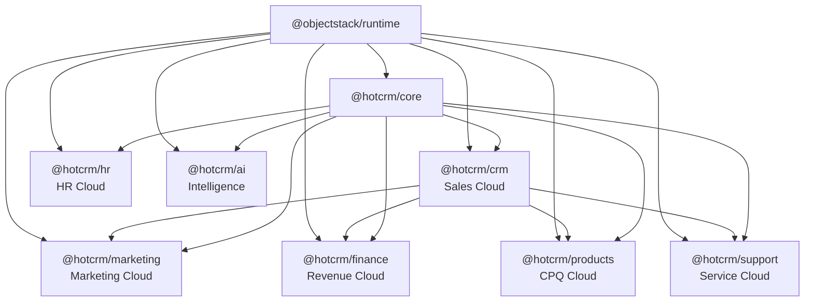

# HotCRM Architecture Guide

> Consolidated architecture overview and plugin system guide for HotCRM.

## Overview

HotCRM is an **AI-Native Enterprise CRM** built on the **@objectstack/runtime** engine. It follows a **Plugin-Based Monorepo** architecture where each business cloud is an independent plugin package.

```
┌─────────────────────────────────────────────────────────┐
│                   HotCRM Application                     │
│              (objectstack.config.ts)                     │
├─────────────────────────────────────────────────────────┤
│  ┌─────────┐ ┌─────────┐ ┌──────────┐ ┌─────────────┐  │
│  │   CRM   │ │Marketing│ │ Products │ │   Finance   │  │
│  │  Sales  │ │  Cloud  │ │   CPQ    │ │  Revenue    │  │
│  └─────────┘ └─────────┘ └──────────┘ └─────────────┘  │
│  ┌─────────┐ ┌─────────┐ ┌──────────┐ ┌─────────────┐  │
│  │ Support │ │   HR    │ │    AI    │ │    Core     │  │
│  │ Service │ │  HCM    │ │  Intel   │ │  Utilities  │  │
│  └─────────┘ └─────────┘ └──────────┘ └─────────────┘  │
├─────────────────────────────────────────────────────────┤
│               @objectstack/runtime                       │
│     ObjectQL  ·  Metadata Registry  ·  REST API          │
└─────────────────────────────────────────────────────────┘
```

## Core Principles

1. **Metadata-First**: All business objects defined in TypeScript (`.object.ts`) — the single source of truth for schema, validation, and UI rendering.
2. **Plugin Architecture**: Each business package is self-contained with objects, hooks, actions, and UI metadata.
3. **ObjectQL**: Type-safe query language replacing raw SQL for all data access.
4. **AI-Native**: Every business object is designed for AI augmentation — scoring, predictions, recommendations.
5. **Schema-Validated**: All metadata files validated against `@objectstack/spec` Zod schemas at module load time.

## Plugin System

### Plugin Definition

Each package exports a plugin definition validated by `PluginSchema.parse()`:

```typescript
// packages/{pkg}/src/plugin.ts
import { PluginSchema } from '@objectstack/spec/kernel';

export default PluginSchema.parse({
  name: 'crm',
  label: 'Sales Cloud',
  description: 'Core CRM objects and business logic',
  objects: { account, contact, lead, opportunity /* ... */ },
  hooks: { account: accountHooks, lead: leadHooks /* ... */ },
  actions: { lead_convert: leadConvertAction /* ... */ },
  workflows: { lead_assignment: leadWorkflow /* ... */ },
});
```

### Plugin Lifecycle

1. **Registration**: Plugins declare objects, hooks, actions, and workflows.
2. **Dependency Resolution**: ObjectStack runtime resolves inter-plugin dependencies.
3. **Metadata Loading**: Object schemas are validated and registered in the metadata registry.
4. **Hook Binding**: Hooks are bound to object lifecycle events (beforeInsert, afterUpdate, etc.).
5. **API Generation**: REST endpoints are auto-generated for all registered objects.

### Plugin Capabilities

Each plugin declares its capabilities via `PluginCapabilityManifestSchema`:

```typescript
// packages/{pkg}/src/{pkg}.capabilities.ts
import { PluginCapabilityManifestSchema } from '@objectstack/spec/kernel';

export default PluginCapabilityManifestSchema.parse({
  pluginName: 'crm',
  capabilities: ['object_management', 'workflow_automation', 'ai_integration'],
  providedObjects: ['account', 'contact', 'lead', 'opportunity'],
  requiredDependencies: [],
});
```

## Package Dependency Graph



## Data Layer

### Object Schema

All objects are defined using `ObjectSchema.create()` from `@objectstack/spec/data`:

```typescript
import { ObjectSchema, Field } from '@objectstack/spec/data';

export default ObjectSchema.create({
  name: 'opportunity',
  label: 'Opportunity',
  description: 'Sales pipeline deal',
  fields: {
    name: Field.text({ label: 'Deal Name', required: true }),
    amount: Field.currency({ label: 'Amount', precision: 18, scale: 2 }),
    stage: Field.select({ label: 'Stage', options: [...] }),
    account: Field.lookup('account', { label: 'Account' }),
    close_date: Field.date({ label: 'Expected Close Date' }),
  },
});
```

### Field Types

HotCRM uses 20+ of the 44 available field types:

| Category | Field Types |
|----------|-------------|
| **Text** | `text`, `textarea`, `email`, `phone`, `url` |
| **Numeric** | `number`, `currency`, `percent` |
| **Date/Time** | `date`, `datetime` |
| **Choice** | `select`, `select({ multiple: true })`, `boolean` |
| **Relationship** | `lookup`, `masterDetail`, `summary` |
| **Media** | `file`, `image` |
| **Location** | `location`, `address` |
| **Computed** | `formula`, `autonumber` |

### ObjectQL

Data access uses ObjectQL — never raw SQL:

```typescript
// Find records
const leads = await broker.find('lead', {
  filters: [['score', '>', 80], ['status', '=', 'qualified']],
  fields: ['name', 'email', 'score', 'company'],
  sort: [{ field: 'score', order: 'desc' }],
  limit: 20,
});

// Create record
await broker.insert('opportunity', {
  name: 'Enterprise Deal',
  amount: 250000,
  stage: 'proposal',
  account: accountId,
});

// Update record
await broker.update('opportunity', id, { stage: 'negotiation' });
```

## Business Logic Layer

### Hooks (Triggers)

Server-side hooks execute during object lifecycle events:

| Event | Timing | Use Case |
|-------|--------|----------|
| `beforeInsert` | Before creation | Validation, field defaulting, de-duplication |
| `afterInsert` | After creation | Notifications, related record creation |
| `beforeUpdate` | Before update | Validation, field recalculation |
| `afterUpdate` | After update | Cascade updates, workflow triggers |
| `beforeDelete` | Before deletion | Referential integrity checks |
| `afterDelete` | After deletion | Cleanup, audit logging |

### Actions

API endpoints and AI-callable tools:

```typescript
// packages/crm/src/lead_convert.action.ts
export async function convertLead(params: { leadId: string }, broker: any) {
  const lead = await broker.findOne('lead', params.leadId);
  const account = await broker.insert('account', { name: lead.company });
  const contact = await broker.insert('contact', { name: lead.name, account: account.id });
  const opportunity = await broker.insert('opportunity', { name: `${lead.company} - New Deal`, account: account.id });
  return { account, contact, opportunity };
}
```

### Workflows

Automated business processes defined via `WorkflowRuleSchema`:

```typescript
import { WorkflowRuleSchema } from '@objectstack/spec/automation';

export default WorkflowRuleSchema.parse({
  name: 'lead_assignment',
  object: 'lead',
  trigger: 'on_create',
  conditions: [{ field: 'status', operator: 'equals', value: 'new' }],
  actions: [{ type: 'field_update', field: 'owner', value: '{{round_robin}}' }],
});
```

## UI Layer

### Page Layouts

Page layouts define the detail view for an object:

```typescript
import { PageSchema } from '@objectstack/spec/ui';

export default PageSchema.parse({
  object: 'account',
  label: 'Account Detail',
  sections: [
    { label: 'Overview', fields: ['name', 'industry', 'website'] },
    { label: 'Financial', fields: ['annual_revenue', 'employee_count'] },
  ],
  relatedLists: ['contacts', 'opportunities'],
});
```

### Dashboards

Dashboards aggregate KPIs from multiple objects:

```typescript
import { DashboardSchema } from '@objectstack/spec/ui';

export default DashboardSchema.parse({
  name: 'sales_dashboard',
  label: 'Sales Performance',
  widgets: [
    { type: 'metric', label: 'Pipeline Value', source: 'opportunity', aggregate: 'sum', field: 'amount' },
    { type: 'chart', label: 'Win Rate by Stage', source: 'opportunity', chartType: 'bar' },
  ],
});
```

## AI Layer

### Agent Workflows

Six autonomous AI agent workflows orchestrate cross-cloud data:

| Agent | Scope | Input → Output |
|-------|-------|----------------|
| **Lead-to-Close** | CRM | Lead → Qualified → Opportunity → Won |
| **Customer 360** | CRM + Finance + Support | Account → Unified profile |
| **Churn Prevention** | CRM + Support + Finance | At-risk signals → Retention actions |
| **Case Resolution** | Support + Knowledge | Case → KB search → Resolution |
| **Talent Acquisition** | HR | Requisition → Source → Interview → Offer |
| **Revenue Optimization** | Finance + Products | Pipeline → Forecast → Pricing |

### MCP Integration

HotCRM provides a Model Context Protocol server for AI agent integration:

```typescript
import { MCPServerConfig } from '@objectstack/spec/ai';

export const mcpServer = {
  tools: 8,       // find_accounts, create_lead, search_knowledge, ...
  resources: 4,   // account_list, pipeline_summary, ...
  prompts: 3,     // sales_briefing, case_summary, ...
};
```

## Security Layer

### Permission Sets

Each cloud defines role-based permissions:

```typescript
import { PermissionSetSchema } from '@objectstack/spec/security';

export default PermissionSetSchema.parse({
  name: 'sales_user',
  label: 'Sales User',
  objectPermissions: [
    { object: 'account', read: true, create: true, edit: true, delete: false },
    { object: 'opportunity', read: true, create: true, edit: true, delete: false },
  ],
});
```

### Sharing Rules

Data visibility is controlled by sharing rules and territory models for account/opportunity access.

## Cross-Cloud Integration

### Integration Patterns

| Flow | Path | Trigger |
|------|------|---------|
| **Lead Conversion** | Lead → Account + Contact + Opportunity | Manual action |
| **Quote to Contract** | Quote → Contract → Invoice | Quote accepted |
| **Campaign Attribution** | Campaign → Lead → Opportunity | Lead created |
| **Case Self-Service** | Case → Knowledge Article search | Case created |
| **Employee Onboarding** | Offer → Employee → Onboarding → Training | Offer accepted |

## Further Reading

- **[DEVELOPMENT_WORKFLOW.md](../DEVELOPMENT_WORKFLOW.md)** — Developer quickstart and contribution guide
- **[ROADMAP.md](../ROADMAP.md)** — Development roadmap and phased execution plan
- **[TESTING.md](../TESTING.md)** — Testing strategy and patterns
- **[CONTRIBUTING.md](../CONTRIBUTING.md)** — Contribution guidelines
