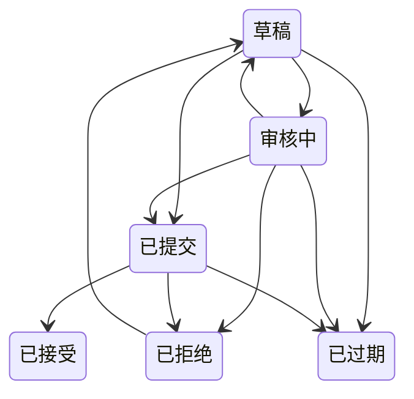

# 报价单——生成与过期

面向销售代表和销售经理。报价单为客户给一笔交易定价；本指南讲的是系统替你填写什么，以及它会自己做什么。

## 生成报价单

在商机上点击**生成报价单**。**报价单详情**界面会询问：

- **报价名称**
- **有效期（天）**——默认 **30**
- **折扣 %**——默认 **0**

商机上的产品明细会逐行复制为报价单明细（产品、数量、销售单价、行折扣、描述）。复制过来的行和你自己添加的行一样定价：目录价取自报价单的价格表。此后两边各自独立：在报价单上修改明细不会改动商机，反过来也一样。

计算由系统完成：小计 = 复制过来的各行之和（商机没有产品明细时取商机金额），折扣金额 = 小计 × 折扣 %，**总金额 = 小计 × (1 − 折扣%)**。

提交后，对话框会显示**报价单已创建**：报价单已保存为**草稿**，名称就是打开它的链接。这个界面上的**完成**只是关闭对话框；无论是否点击，报价单都已经创建好了。如果有明细未能复制（报价单价格表里没有该产品的有效价格，或该行折扣超过行折扣上限），对话框会告诉你缺了几行；其他行照样复制，缺的行请在报价单上补上。

## 报价单状态

报价单通常沿下图流转。偏离箭头的变更照样会保存，保存结果会附带一条警告，写明通常的流转路径。**已接受**和**已过期**是报价单的终点；被拒绝的报价单可以退回**草稿**重新修改。

```mermaid
stateDiagram-v2
  state "草稿" as draft
  state "审核中" as in_review
  state "已提交" as presented
  state "已接受" as accepted
  state "已拒绝" as rejected
  state "已过期" as expired
  draft --> in_review
  draft --> presented
  draft --> expired
  in_review --> draft
  in_review --> presented
  in_review --> rejected
  in_review --> expired
  presented --> accepted
  presented --> rejected
  presented --> expired
  rejected --> draft
```

### 推进报价单

每条需要手动走的箭头在报价单上都有一个按钮，只在它出发的状态上显示：草稿上的**提交审核**，审核中的**标记为已提交**，已提交的**接受**，审核中或已提交的**拒绝**，以及审核中或已拒绝的**修订**（退回草稿）。**接受**需要报价单的签署副本（见下文），并会先确认，因为在报价单上无法撤回：它会冻结报价单、把商机关闭为赢单并创建它的订单。这些按钮只对可以编辑该报价单的人显示。转为**已过期**没有按钮，由下面的每日任务完成。从**草稿**直接转为**已提交**，靠打印报价单完成（见下文）。

新建的报价单只能从**草稿**、**审核中**或**已提交**开始。新建表单不提供已接受、已拒绝和已过期，以这三种状态创建报价单的保存会被拒绝。

### 已结束的报价单

**已接受**、**已拒绝**或**已过期**的报价单已经结束。它不显示**编辑**，它的报价明细也不显示**新建**，只有**内部备注**还能修改。**已拒绝**的报价单要重新修改，请点击**修订**：它会退回**草稿**，在草稿上字段和明细都可以再次编辑。

## 打印报价单

报价单上以及报价单列表行菜单里的**打印报价**，会把报价单打印成一份文档，并以你的名义把 PDF 归档到报价单的**附件**中。这个按钮只对可以编辑该报价单、并且可以添加附件的人显示。

打印即提交：PDF 归档后，**草稿**或**审核中**的报价单会转为**已提交**。其他状态的报价单保持原状态，所以可以随时重新打印；你自己上传的附件不会改变状态。这次状态变更是以你的名义进行的普通保存，所以没有填写**联系人**的报价单照样会打印并归档，但状态不变，而且不会有任何提示。打印后请查看状态；补上联系人后再打印一次即可。

## 归档签署副本

客户签好报价后，在报价单处于**已提交**时，把客户寄回的文件上传到报价单的**签署副本**。**报价单必须有签署副本才能接受：** 在上传文件之前，**接受**按钮和任何把报价单改为**已接受**的保存都会被拒绝，并指明**签署副本**。在这条规则之前就已接受的报价单保持原样。

## 报价单被接受时

接受报价单会让对应商机赢单，并创建它的**订单**：一张**草稿**订单，带着报价单的明细和合计，它的**来源报价单**就是这份报价单。订单会列在报价单的页面上。每份被接受的报价单只有一张订单。

**不再自动起草合同。** 在本版本之前，接受报价单还会起草一份合同。这次销售需要合同时，打开订单并点击**起草合同**：它会起草同一份合同，金额为订单的总金额，并让订单指向这份合同（见[订单](./crm_sales_orders.md)）。稍后你会收到一条**合同已起草**的通知，写明合同编号，并带有打开合同的**查看**链接。合同的期限和合同类型只是初始值，激活前请先核对。

如果管理员希望每份被接受的报价单都像本版本之前一样起草合同，开启**已接受的报价单起草合同**流程即可，此后报价单的订单会指向这份合同。不使用订单的部署可以关闭**已接受的报价单创建订单**。路径：控制台首页的 **在 Studio 中新建**（Studio 会先打开*新建软件包*表单，点 **取消** 关掉）→ **HotCRM Revenue** → **定制** → **自动化** → 该流程（列表里显示英文名），再点 *本部署中已停用*（或已启用）旁边的开关。两项选择在重启和升级后都会保留。

## 报价单自动过期（自动）

在开启了计划任务的部署上，每天 **01:00** 的任务会把已过到期日期、仍未结束的报价单标记为**已过期**。默认安装启动时这个任务未绑定，过期的报价单会保持原状态，直到有人修改它。如果交易仍在进行，请重新出一份报价单。

---

**相关：** 报价单所定价的那笔商机——见[商机](./crm_sales_opportunities.md)。
